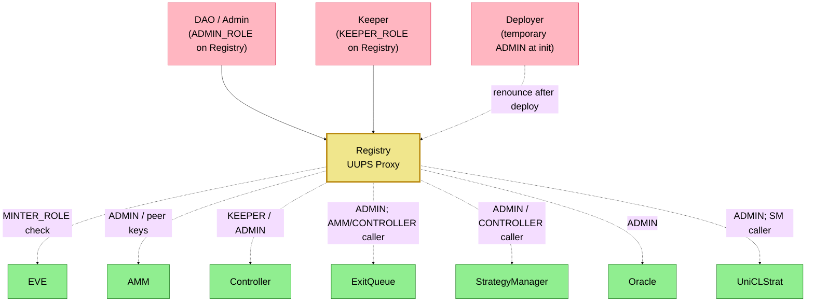

# Access Control Architecture

## Registry-Centric Authority Model

All operational roles (`ADMIN_ROLE`, `KEEPER_ROLE`, `MINTER_ROLE`) are granted and checked on **Registry**. Protocol contracts use `RegistryClient` mixins (`onlyValidRole`, `onlyValidContract`) — they do not hold local AccessControl roles for protocol operations.

## Access Control Matrix (via Registry)

| Function | Checked role / caller | Contract |
|----------|----------------------|----------|
| **Mint / Burn EVE** | `MINTER_ROLE` on Registry | EVE |
| **Set connector weight / pause AMM** | `ADMIN_ROLE` on Registry | AMM |
| **processRedemption** | Registered `CONTROLLER` | AMM |
| **Keeper ops / emergency / pause Controller** | `KEEPER_ROLE` or `ADMIN_ROLE` on Registry | Controller |
| **push / pull / price batch** | Registered `AMM` / `CONTROLLER`; gated by `whenNotPaused` | ExitQueue |
| **close request** | Registered `AMM`; works when paused (emergency withdrawal) | ExitQueue |
| **pause ExitQueue** | `ADMIN_ROLE` on Registry | ExitQueue |
| **add/remove strategy / force-remove / pause SM / fee config** | `ADMIN_ROLE` on Registry | StrategyManager |
| **harvestPerformanceFeeFromStrategy(s)** | `ADMIN_ROLE` or `KEEPER_ROLE` on Registry | Controller |
| **harvestPerformanceFeeFromStrategy(s)** (delegate) | Registered `CONTROLLER` | StrategyManager |
| **depositToStrategies / withdraw / rebalance / sync** | Registered `CONTROLLER` | StrategyManager |
| **totalNAVInETH** | — (view; requires `AMM` key registered) | StrategyManager |
| **updateTokenInfo** | `ADMIN_ROLE` on Registry | Oracle |
| **pause / upgrade Oracle** | `ADMIN_ROLE` on Registry | Oracle |
| **deposit / withdraw / rebalance / sync** | Registered `STRATEGY_MANAGER` | UniCLStrat |
| **emergencyExit / config** | `ADMIN_ROLE` or `SECURITY_ROLE` on Registry | UniCLStrat |
| **registerContract / grantRole** | `ADMIN_ROLE` on Registry | Registry |

## Protocol Roles (Registry)

| Role | Typical grantee | Purpose |
|------|-----------------|----------|
| `ADMIN_ROLE` | DAO | Register contracts, grant/revoke roles, Oracle feed configuration, pause/upgrade modules |
| `KEEPER_ROLE` | Keeper bot / multisig | Controller automation |
| `MINTER_ROLE` | AMM, StrategyManager | EVE mint/burn (AMM enter/exit; SM performance-fee harvest) |

## Deployer Admin Lifecycle

1. **Registry.initialize(dao)**: grants `ADMIN_ROLE` to `dao` and `msg.sender` (deployer).
2. **Modular deploy**: deployer uses ADMIN to `registerContract` / `grantRoles`.
3. **Finalize**: if `deployer != dao`, deployer calls `renounceRole(ADMIN_ROLE, deployer)` on Registry (works even when Registry is paused).
4. **Post-finalize**: only `dao` (and other granted roles) retain Registry authority.

## Key Security Principles

- **Single source of truth**: Registry holds addresses (`Auth`) and roles (`Auth`).
- **No local DEPLOYER_ROLE**: Removed from Controller, ExitQueue, EVE, StrategyManager.
- **Peer immutability by governance**: Addresses change only via Registry `registerContract` (ADMIN).
- **Fail-closed peers**: Missing or unregistered keys revert with `RegistryContractNotRegistered`.
- **Immutable core**: EVE, AMM, and strategy contracts are not upgradeable.
