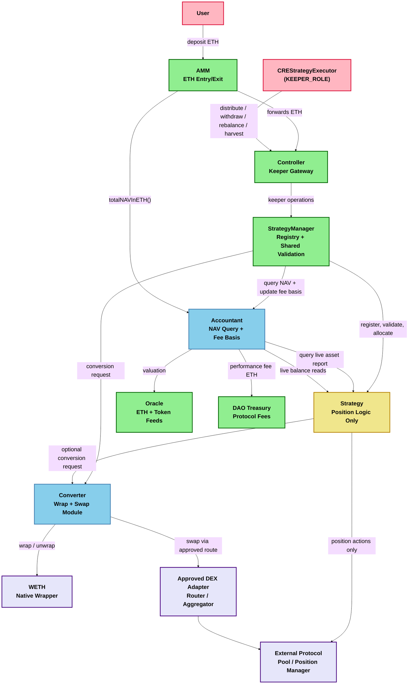
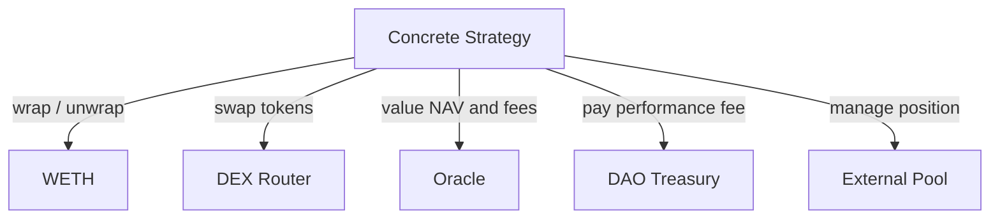
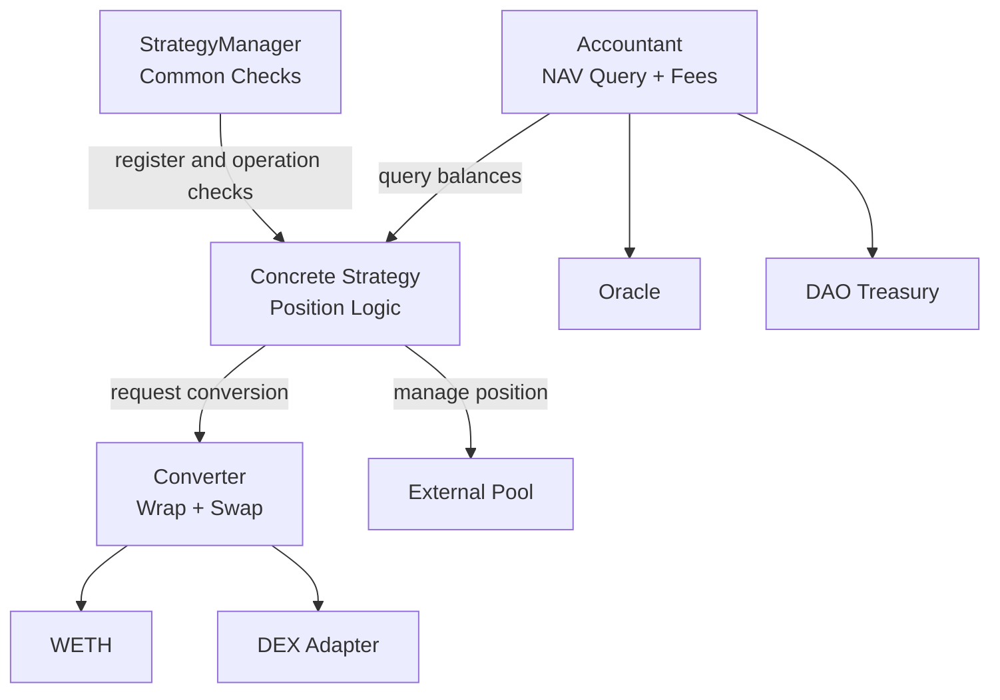
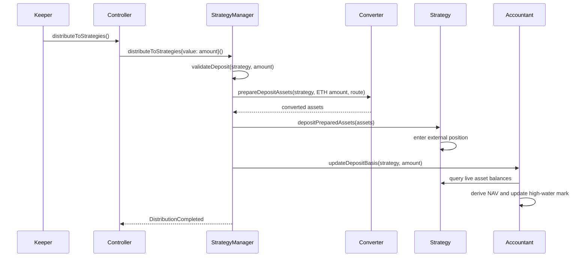
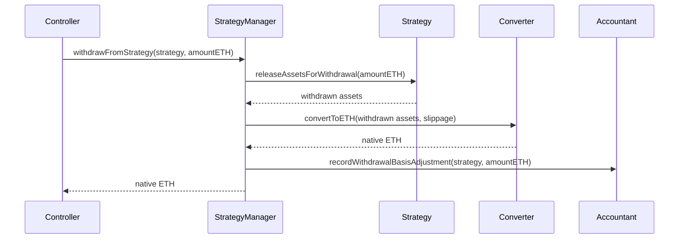
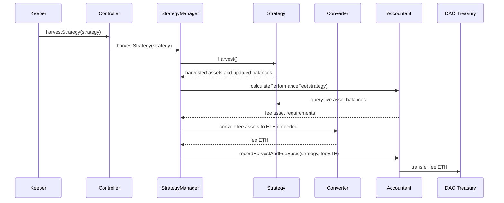

## Strategy Asset Converter And Accounting Module

## Purpose

This document proposes a reusable protocol module that removes WETH wrapping, WETH unwrapping, and external DEX swaps from individual strategy implementations.

The goal is to keep strategies focused on protocol-specific position management while shared protocol contracts handle:

- Native ETH / WETH conversion.
- Token swaps through approved external DEX adapters.
- Centralized multi-asset accounting across strategies.
- Performance fee harvesting at the protocol accounting layer.
- Strategy validation and risk metadata checks inside `StrategyManager` instead of individual concrete strategies.

This addresses the reviewer feedback that validation, safety-level checks, token accounting, fee harvesting, and swap plumbing should live at the protocol level instead of being duplicated inside every strategy.

## Proposed Components

### Converter

`Converter` is a shared contract used by `StrategyManager`, `Controller`, or registered strategies to convert between native ETH, WETH, and strategy tokens.

Responsibilities:

- Wrap incoming native ETH into WETH.
- Unwrap WETH into native ETH for withdrawals and fee payouts.
- Execute token swaps through approved DEX adapters.
- Enforce slippage, route allowlists, recipient allowlists, and deadline checks.
- Emit centralized swap and wrap events for accounting and monitoring.
- Keep router approvals isolated from strategy contracts.

Strategies should no longer hold direct router configuration or call external DEX routers directly. A strategy may request a conversion, but the converter owns the external swap integration and validates the route.

### Accountant

`Accountant` is a centralized accounting query and fee-basis module above individual strategies. It should avoid duplicating source-of-truth balances already held by strategies, `Controller`, `StrategyManager`, or `Converter`.

Responsibilities:

- Standardize how ETH, WETH, USDC, paired strategy tokens, and other approved assets are queried and valued.
- Aggregate live strategy balance reports into protocol-level NAV.
- Convert multi-token balances into ETH-denominated NAV through the protocol oracle.
- Store only accounting state that cannot be derived safely from live balances, such as high-water marks, realized fees, pending fees, and fee basis adjustments.
- Charge protocol fees above strategies instead of inside each strategy.
- Expose pending and realized fee information for monitoring.

Strategies should report asset balances and position state through a standardized interface. They should not independently decide how much protocol performance fee is owed.

### StrategyManager Validation Layer

Shared validation should be incorporated into `StrategyManager`, either directly in the contract or through an internal validation library. A separate `StrategyValidator` contract is not required unless the validation surface grows enough to justify its own upgradeable module.

Responsibilities:

- Validate safety level and withdrawal priority bounds.
- Validate strategy metadata and supported asset lists.
- Validate that a strategy uses approved converter and accounting modules.
- Validate route and token compatibility before a strategy is registered.
- Provide reusable checks for deposit, withdraw, rebalance, and harvest flows.

The important architectural change is that common validation should not be implemented only inside each concrete strategy. Concrete strategies can still perform strategy-specific invariant checks, but protocol-level validation should be enforced by `StrategyManager`.

## High-Level Architecture

## Responsibility Shift

### Before

### After

## Updated Strategy Boundary

Concrete strategies should keep only strategy-specific responsibilities:

- Manage external protocol positions, such as Uniswap V3 liquidity ranges.
- Report asset balances, position liquidity, pending fees, and health state.
- Define strategy-specific invariants, such as tick ranges, pool calm checks, and callback validation.
- Accept already-prepared assets from `StrategyManager` or receive converted assets through `Converter`.
- Return assets to the protocol without directly unwrapping WETH or routing DEX swaps unless an emergency escape path is explicitly approved.

Concrete strategies should not:

- Store DEX router addresses.
- Store swap paths as strategy-owned configuration.
- Approve arbitrary routers.
- Wrap or unwrap WETH as routine business logic.
- Calculate and transfer protocol performance fees.
- Own protocol-level safety-level validation.

## Updated Deposit Flow

The exact function names can differ during implementation. The important contract boundary is that conversion is handled before assets enter the strategy or through a shared converter call, not by strategy-owned router logic.

## Updated Withdraw Flow

Withdrawals remain ETH-first for the rest of the protocol, but strategies can return the actual assets they hold. The converter centralizes liquidation back into ETH.

## Unified Harvest Flow

> **Implemented (current):** Performance fees use strategy-local LP-fee accounting (`IStrategy.pendingPerformanceFeeInETH` / `settlePerformanceFee`) with StrategyManager orchestrating EVE mint settlement to `daoTreasury`. Keeper/admin entry is `Controller.harvestPerformanceFeeFromStrategy(s)` (`ADMIN_ROLE` or `KEEPER_ROLE`); StrategyManager harvest is `CONTROLLER`-only with one EVE mint per batch. See `StrategyManager.sol`, `UniCLStrat.sol`, and `mermaid/uniswap-concentrated-liquidity-strategy-spec.md` § DAO Performance Fees.

The section below describes a **future** unified harvest design (not yet implemented):

The previous split between `harvest()` and `harvestPerformanceFee()` should be collapsed into one protocol-level harvest operation.

Recommended flow:

`harvest()` should mean "realize yield, update accounting, and pay any owed protocol fee if possible." If conversion cannot satisfy fee slippage constraints, accounting can keep the fee pending without blocking emergency withdrawals.

## Accounting Model

`Accountant` should treat strategy NAV as a multi-asset balance sheet rather than a single strategy-owned ETH value, but it should not maintain a duplicate balance sheet that can drift from strategy reality.

Recommended source-of-truth rule:

- Live balances stay where the assets actually are: `Controller`, `StrategyManager`, `Converter`, or the strategy.
- Strategies expose standardized balance and position views.
- `Accountant` derives NAV by querying live balances and valuing them.
- `Accountant` stores only non-derivable accounting state, such as high-water marks, realized performance fees, pending fee debt, fee-basis adjustments after deposits and withdrawals, and historical snapshots if needed for reporting.
- If a cached snapshot is introduced for gas or reporting, it must be explicitly marked as a snapshot and refreshed through deterministic keeper flows, not treated as canonical asset ownership.

Required accounting query inputs:

- Idle native ETH held by Controller, StrategyManager, or converter.
- Idle WETH.
- Idle USDC and other approved ERC20 assets.
- Strategy-held token balances.
- External protocol position balances, such as LP token amounts or Uniswap V3 position liquidity.
- Uncollected external protocol fees.
- Pending but unpaid protocol performance fees.

Recommended query outputs:

- `totalNAVInETH()` for AMM pricing.
- `strategyNAVInETH(address strategy)` for strategy allocation.
- `assetBalances(address strategy)` for monitoring.
- `liveAssetBalances(address strategy)` for canonical strategy balance reads.
- `pendingPerformanceFee(address strategy)` for keeper visibility.
- `realizedPerformanceFees(address strategy)` for reporting.

Fee basis should live in accounting:

- High-water marks are tracked per strategy in ETH terms.
- Deposits increase the fee basis so deposits are not counted as profit.
- Withdrawals reduce the fee basis pro rata.
- Losses reduce current NAV but do not create fees.
- Recovery after losses only creates fees above the high-water mark.

## Converter Rules

`Converter` should enforce strict route controls:

- Only approved input and output tokens.
- Only approved routers or adapter contracts.
- Only approved strategy callers or `StrategyManager`.
- Minimum output and maximum input checks.
- Deadline checks for every swap.
- Recipient checks so assets cannot be routed to arbitrary addresses.
- Oracle or TWAP sanity checks before large conversions.
- Approval reset or bounded approval patterns for external routers.

The converter should emit events for every conversion:

- `ETHWrapped(address indexed caller, uint256 amount)`
- `WETHUnwrapped(address indexed caller, address indexed receiver, uint256 amount)`
- `SwapExecuted(address indexed caller, address indexed tokenIn, address indexed tokenOut, uint256 amountIn, uint256 amountOut)`
- `AdapterUpdated(address indexed adapter, bool allowed)`

## Validation And Safety Levels

Safety level and withdrawal priority checks should be moved into protocol-level validation.

Recommended approach:

- `StrategyManager.addStrategy()` runs shared strategy validation before registration.
- `StrategyManager` stores approved safety levels and withdrawal priorities, or reads them through a validated registry.
- Strategy-reported values may be used as metadata, but `StrategyManager` should enforce bounds before allocation.
- `StrategyManager` checks that strategies are configured with approved `Converter`, `Accountant`, oracle, and supported tokens.
- Concrete strategies keep only specialized checks, such as Uniswap pool callback validation and calm-period checks.

This prevents each strategy from inventing its own risk validation rules and makes allocation logic easier to audit.

## Deployment Shape

Suggested deployment order:

1. Deploy or upgrade `Oracle`.
2. Deploy `Converter` as an upgradeable management module.
3. Deploy `Accountant` as an upgradeable management module.
4. Upgrade or configure `StrategyManager` to use accounting, converter, and shared validation.
5. Register approved routers, route adapters, tokens, and strategies.
6. Add strategies only after validation passes.

`Converter` and `Accountant` are management-layer contracts and should be upgradeable. Concrete strategy contracts can remain static or non-upgradeable.

## Impact On UniCLStrat

The Uniswap concentrated liquidity strategy should be simplified:

- Remove direct WETH wrap and unwrap logic from normal deposit and withdraw paths.
- Remove direct swap router ownership from the strategy.
- Replace strategy-owned performance fee logic with accounting-level fee reporting.
- Replace `harvestPerformanceFee()` with the unified `harvest()` path.
- Keep Uniswap-specific position math, tick placement, liquidity mint/burn/collect, and pool callback validation.
- Report token0, token1, active liquidity, and uncollected fees to `Accountant`.
- Use `Converter` for WETH / paired-token balancing before adding liquidity and for liquidation on withdrawal.

## Open Design Decisions

- Whether strategies call `Converter` directly or only `StrategyManager` can call it.
- Whether `Accountant` pulls balances from strategies or strategies push reports after each action.
- Whether converter routes are simple token-pair configs or adapter contracts per DEX.
- Whether `StrategyManager` implements validation directly or delegates to an internal library.
- Whether `totalNAVInETH()` moves from `StrategyManager` to `Accountant`, or `StrategyManager` keeps the public interface and delegates calculation.

## Implementation Checklist

- Define `IConverter` with wrap, unwrap, swap, and route-management functions.
- Define `IAccountant` with NAV, asset balance, harvest, and performance-fee functions.
- Add shared validation functions to `StrategyManager` or an internal validation library for registration and operation checks.
- Update `StrategyManager` to delegate conversion and accounting responsibilities.
- Update strategy interfaces so strategies can report multi-asset balances.
- Refactor `UniCLStrat` to remove router, WETH wrapping, and performance-fee payment logic.
- Add tests for converter slippage, route allowlists, approval safety, and unauthorized calls.
- Add tests for accounting high-water mark behavior across deposits, withdrawals, losses, recoveries, and pending fee conversion failures.
