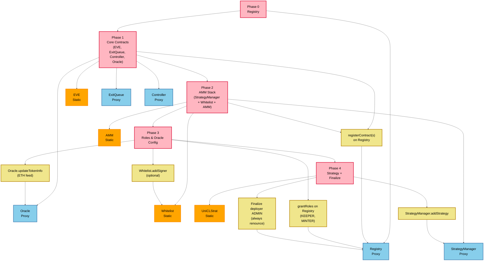

# Deployment Architecture

## Registry-Centric Deployment Strategy



## Deployment Scripts

| Script | Deploys | Registers on Registry | Notes |
|--------|---------|----------------------|-------|
| `DeployRegistry.s.sol` | Admin timelock + Registry | — | Registry's designated ADMIN is the 48h admin `TimelockController` (`DAO_ADDRESS` = proposer, `SECURITY_ADDRESS` = canceller); grants `SECURITY_ROLE` to the security multisig; deployer keeps a temporary bootstrap ADMIN |
| `DeployEVE.s.sol` | EVE | `EVE` | Requires `REGISTRY_ADDRESS` |
| `DeployExitQueue.s.sol` | ExitQueue proxy | `EXIT_QUEUE` | Requires `REGISTRY_ADDRESS` |
| `DeployController.s.sol` | Controller proxy | `CONTROLLER` | Requires `REGISTRY_ADDRESS` |
| `DeployOracle.s.sol` | Oracle proxy | `ORACLE` | Requires `REGISTRY_ADDRESS`, `PRICE_FEED`, `TIMELOCK_ADDRESS` |
| `DeployConverter.s.sol` | Converter proxy | `CONVERTER` | Requires `REGISTRY_ADDRESS`, `WETH_ADDRESS`; grants `CONVERTER_CALLER_MANAGER_ROLE` to the Converter (required by `StrategyManager.addStrategy`); optionally whitelists `SWAP_ADAPTER_ADDRESS` (DeployUniCLStrat prerequisite) |
| `DeployAMM.s.sol` | StrategyManager + AMM | `STRATEGY_MANAGER`, `AMM` | Initializes SM with `FeeConfig` (`DAO_TREASURY_ADDRESS`, `PERFORMANCE_FEE_BPS`); grants `MINTER_ROLE` to BOTH the AMM and the StrategyManager (deployer keeps ADMIN for later steps) |
| `DeployWhitelist.s.sol` | Whitelist | `WHITELIST` | Requires `REGISTRY_ADDRESS`, `WHITELIST_SIGNER_ADDRESS` (explicit `address(0)` postpones invite-signer seeding); redeploys start empty |
| `DeployAll.s.sol` | Full stack incl. Whitelist + both keeper executors | All keys + keeper keys | Grants protocol roles; `KEEPER_ROLE` only to executors; initializes SM fee config; seeds Whitelist signer when non-zero; unconditionally renounces deployer admin |
| `DeployKeeperExecutors.s.sol` | Queue + Strategy keeper executors | `QUEUE_KEEPER_EXECUTOR`, `STRATEGY_KEEPER_EXECUTOR` | Requires `REGISTRY_ADDRESS`, `EXIT_LIQUIDITY_TARGET_ETH`, `CONTROLLER_RESERVE_ETH` (wei); grants `KEEPER_ROLE` (optional via `GRANT_KEEPER_ROLE`); run before finalize |
| `FinalizeProtocolDeploy.s.sol` | — | — | Unconditionally renounces deployer ADMIN (required final modular step; requires `TIMELOCK_ADDRESS`, `SECURITY_ADDRESS`); VERIFIES every critical grant (`SECURITY_ROLE` → security, `MINTER_ROLE` → AMM + StrategyManager, `CONVERTER_CALLER_MANAGER_ROLE` → Converter, `KEEPER_ROLE` → both executors) and reverts loudly on any skipped/mis-granted step |
| `DeployUniCLStrat.s.sol` | UniCLStrat | — | `addStrategy` on StrategyManager via the deployer's bootstrap ADMIN grant; on a live protocol this must be scheduled through the admin timelock |

Shared helpers live in `script/ProtocolDeployBase.sol` (mirrors `test/helpers/ProtocolTestBase.sol`).

## Environment Variables

Critical addresses and StrategyKeeperExecutor policy knobs are **required**
(`vm.envAddress` / `vm.envUint` revert when unset) — they never default to the
deployer key or a silent zero. Only numeric operational parameters that are
unambiguously conservative (`PERFORMANCE_FEE_BPS`, `TIMELOCK_ADMIN_DELAY`) have
defaults. Setting `EXIT_LIQUIDITY_TARGET_ETH` or `CONTROLLER_RESERVE_ETH` to `0`
is a valid explicit choice; omitting them is not.

| Variable | Used by | Purpose |
|----------|---------|---------|
| `PRIVATE_KEY` | All scripts | Broadcast signer (temporary bootstrap ADMIN only) |
| `DAO_ADDRESS` | DeployRegistry, DeployAll | **Required.** DAO multisig — timelock proposer/canceller; no direct protocol role |
| `SECURITY_ADDRESS` | DeployRegistry, DeployAll, FinalizeProtocolDeploy | **Required.** Security multisig — SECURITY_ROLE + timelock canceller |
| `DAO_TREASURY_ADDRESS` | DeployAll, DeployAMM | **Required.** Performance-fee EVE recipient |
| `PERFORMANCE_FEE_BPS` | DeployAll, DeployAMM | Initial StrategyManager fee rate in bps (default 0) |
| `EXIT_LIQUIDITY_TARGET_ETH` | DeployAll, DeployKeeperExecutors | **Required** (wei). AMM free-balance target for ProvideExitLiquidity; `0` disables immediate exits |
| `CONTROLLER_RESERVE_ETH` | DeployAll, DeployKeeperExecutors | **Required** (wei). ETH kept idle on the Controller; `0` means no reserve |
| `TIMELOCK_ADMIN_DELAY` | DeployRegistry, DeployAll | Admin timelock min delay (default 48h) |
| `REGISTRY_ADDRESS` | Partial deploy scripts, DeployKeeperExecutors | Existing Registry (logged by DeployRegistry) |
| `TIMELOCK_ADDRESS` | DeployOracle, FinalizeProtocolDeploy | Existing admin timelock (logged by DeployRegistry) |
| `PRICE_FEED` | DeployOracle, DeployAll | **Required.** Chainlink ETH/USD feed |
| `WETH_ADDRESS` | DeployAll, DeployConverter | **Required.** WETH for the Converter |
| `SWAP_ADAPTER_ADDRESS` | DeployConverter (optional), DeployUniCLStrat | DEX adapter to whitelist on the Converter during bootstrap |
| `WHITELIST_SIGNER_ADDRESS` | DeployAll, DeployWhitelist | **Required.** Initial invite-signer key; explicit `address(0)` postpones seeding (add later via timelocked `addSigner`) |
| `GRANT_KEEPER_ROLE` | DeployKeeperExecutors | Grant `KEEPER_ROLE` to both executors (default true) |

## Deployment Sequence

### Option A: One-shot (`DeployAll`)

```solidity
// 1. Admin timelock (DAO proposer, security canceller), then Registry — designated ADMIN is
//    the timelock; the deployer keeps a temporary bootstrap ADMIN grant (the Registry
//    constructor rejects _admin == msg.sender, so the deployer cannot be the designated admin)
TimelockController adminTimelock = deployTimelock(dao, security);
Registry registry = deployRegistry(address(adminTimelock));

// 2. Core contracts — all wired with registry address
EVE eve = new EVE(address(registry));
ExitQueue exitQueue = deployExitQueue(registry);
Controller controller = deployController(registry);
Oracle oracle = deployOracle(registry);
StrategyManager strategyManager = deployStrategyManager(registry, FeeConfig({
    daoTreasury: daoTreasuryAddress,  // DAO_TREASURY_ADDRESS env, required
    performanceFeeBps: performanceFeeBps  // PERFORMANCE_FEE_BPS env, default 0
}));
AMM amm = new AMM(address(registry), connectorWeight);
Whitelist whitelist = new Whitelist(address(registry));

// 3. Register core Auth keys + grant non-keeper roles on Registry
registry.registerContracts([CONTROLLER, AMM, STRATEGY_MANAGER, EXIT_QUEUE, ORACLE, EVE, CONVERTER, WHITELIST], [...]);
registry.grantRoles([ADMIN, SECURITY, MINTER, MINTER, CONVERTER_CALLER_MANAGER], [adminTimelock, security, amm, strategyManager, converter]);

// 4. Dedicated keeper step (shared with DeployKeeperExecutors)
(queueExecutor, strategyExecutor) = deployKeeperExecutors(registry);
// registers QUEUE_KEEPER_EXECUTOR + STRATEGY_KEEPER_EXECUTOR, grants KEEPER_ROLE,
// and applies EXIT_LIQUIDITY_TARGET_ETH / CONTROLLER_RESERVE_ETH (required wei env)

// 5. Oracle feed + optional Whitelist signer seed + deployer admin cleanup
oracle.updateUsdFeedInfo(address(0), priceFeed, stalenessInterval);
if (whitelistSigner != address(0)) whitelist.addSigner(whitelistSigner);
registry.renounceRole(ADMIN_ROLE, deployer); // always — ADMIN ends held only by the timelock
// Then: register Chainlink upkeeps → setForwarder on each executor
```

### Option B: Modular (recommended order)

```bash
# requires DAO_ADDRESS + SECURITY_ADDRESS; deploys the admin timelock + Registry
forge script script/DeployRegistry.s.sol:DeployRegistry --broadcast
# export REGISTRY_ADDRESS=<registry> TIMELOCK_ADDRESS=<admin_timelock>

forge script script/DeployEVE.s.sol:DeployEVE --broadcast
forge script script/DeployExitQueue.s.sol:DeployExitQueue --broadcast
forge script script/DeployController.s.sol:DeployController --broadcast
forge script script/DeployOracle.s.sol:DeployOracle --broadcast

# Converter: registers CONVERTER and grants CONVERTER_CALLER_MANAGER_ROLE (required by
# StrategyManager.addStrategy); set SWAP_ADAPTER_ADDRESS to whitelist the DEX adapter
forge script script/DeployConverter.s.sol:DeployConverter --broadcast

# Invite entry gate: registers WHITELIST; WHITELIST_SIGNER_ADDRESS required
# (address(0) postpones invite-signer seeding)
forge script script/DeployWhitelist.s.sol:DeployWhitelist --broadcast

forge script script/DeployAMM.s.sol:DeployAMM --broadcast
# DeployAMM no longer finalizes — the deployer keeps ADMIN for the steps below

forge script script/DeployKeeperExecutors.s.sol:DeployKeeperExecutors --broadcast
# Requires EXIT_LIQUIDITY_TARGET_ETH + CONTROLLER_RESERVE_ETH (wei); grants KEEPER_ROLE
# (set GRANT_KEEPER_ROLE=false to timelock grants)

forge script script/DeployUniCLStrat.s.sol:DeployUniCLStrat --broadcast
# FinalizeProtocolDeploy is the required final step (unconditional deployer renounce)
forge script script/FinalizeProtocolDeploy.s.sol:FinalizeProtocolDeploy --broadcast
# Then: register Chainlink upkeeps → setForwarder on each executor
```

Each partial script calls `_registerAndVerify` so the contract is live on Registry before the script finishes.

### Deployer admin finalization

The Registry constructor grants `ADMIN_ROLE` to both `_admin` (the admin timelock — it rejects `_admin == msg.sender`, so the deployer cannot be the designated admin) and `msg.sender` (deployer, temporary). The deployer needs that role during modular deploy to register contracts, configure the Oracle feed, and grant roles — those calls are ADMIN_ROLE (48h timelock)-gated in production, which is why they run inside the bootstrap window. Under PL-003 the deployer **always** renounces `ADMIN_ROLE` once setup completes via `_finalizeDeployerTieredAccess` — ADMIN_ROLE must end held only by the admin `TimelockController` (`renounceRole` is not blocked by Registry pause).

- **DeployAll** renounces the deployer's ADMIN automatically at the end.
- **DeployRegistry** and **DeployAMM** do not finalize — the deployer keeps ADMIN for subsequent scripts.
- **FinalizeProtocolDeploy** is the explicit, required last step of a modular deploy. Beyond renouncing, it verifies every critical grant (`SECURITY_ROLE` → security multisig, `MINTER_ROLE` → AMM + StrategyManager, `CONVERTER_CALLER_MANAGER_ROLE` → Converter, `KEEPER_ROLE` → both keeper executors) and every module registration, reverting loudly when a modular step was skipped or a grant is missing — a gap found only at runtime would need a 48h-timelocked repair. When keeper grants were deferred (`GRANT_KEEPER_ROLE=false`), finalize only after the timelocked grants have executed.

## Contract Addresses

| Contract | Type | Registry Key |
|----------|------|--------------|
| Registry | Upgradeable | — (hub) |
| EVE | Static | `EVE` |
| AMM | Static | `AMM` |
| Whitelist | Static | `WHITELIST` |
| Controller | Upgradeable | `CONTROLLER` |
| ExitQueue | Upgradeable | `EXIT_QUEUE` |
| StrategyManager | Upgradeable | `STRATEGY_MANAGER` |
| Oracle | Upgradeable | `ORACLE` |
| Converter | Upgradeable | `CONVERTER` |
| QueueKeeperExecutor | Static | `QUEUE_KEEPER_EXECUTOR` |
| StrategyKeeperExecutor | Static | `STRATEGY_KEEPER_EXECUTOR` |
| UniCLStrat | Static | — (registered in StrategyManager only) |

## Security Considerations

- **No per-contract DEPLOYER_ROLE**: Wiring is `Registry.registerContract`; peers are resolved via `Auth` at runtime.
- **Registry ADMIN**: Self-administered; only Registry ADMIN can register contracts and grant operational roles.
- **Temporary deployer ADMIN**: Always renounced at the end of deployment; the Registry constructor rejects `_admin == msg.sender`, so the deployer key cannot be the designated admin.
- **Peer resolution**: Unregistering a key (e.g. `AMM`) causes consumers to revert with `RegistryContractNotRegistered` until re-registered.
- **Immutable core**: EVE, AMM, Whitelist, and strategies remain non-upgradeable.

## Testing

- `test/integration/DeploymentTest.t.sol` — Registry wiring and role grants
- `test/integration/DeployerAdminAccessTest.t.sol` — deployer admin finalization scenarios
- `test/unit/Registry.t.sol` — Registry unit and integration tests
- Trees: `test/trees/Registry.tree`, `test/trees/ProtocolDeploy.tree`
