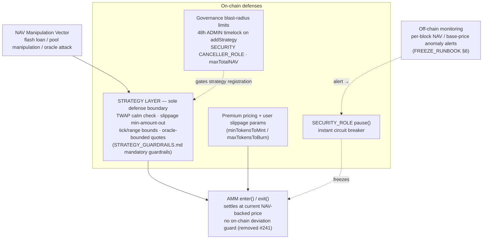
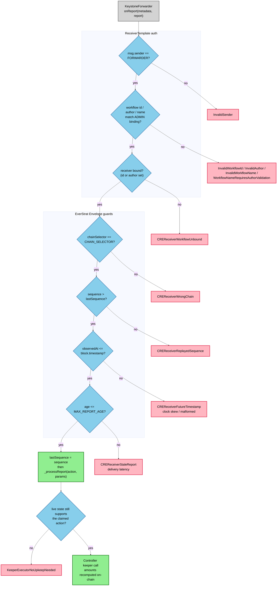
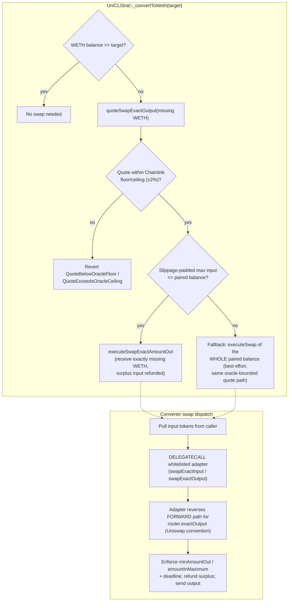

# Smart Contracts Architecture

## Current Architecture Overview

```mermaid
%%{init: {'theme':'base', 'themeVariables': { 'fontSize': '32px', 'primaryTextColor': '#000000'}, 'flowchart': {'nodeSpacing': 150, 'rankSpacing': 150, 'padding': 40}}%%
graph TB
    %% External Libraries
    ERC20["ERC20<br/>Standard"]
    UUPS["UUPS<br/>Upgradeable"]
    AccessControl["Access<br/>Control"]
    Pausable["Pausable<br/>Upgradeable"]
    ReentrancyGuard["ReentrancyGuard<br/>Upgradeable"]
    Proxy["ERC1967<br/>Proxy"]
    OZLibs["OpenZeppelin<br/>Libraries"]
    Math["Math<br/>Library"]
    ExitQueueLimits["ExitQueueLimits<br/>Library"]
    UniV3Math["Uniswap V3 Shared Libraries<br/>TickMath, FullMath,<br/>LiquidityAmounts, TickUtils<br/>(libraries/integrations/uniswap)"]
    UniswapV3Path["UniswapV3Path<br/>Path Encoding Library<br/>(libraries/integrations/uniswap)"]
    ChainlinkOracle["Chainlink<br/>Oracle"]
    UniswapPool["Uniswap V3<br/>Pool"]
    SwapRouter["Uniswap V3<br/>Swap Router"]
    UniswapFactory["Uniswap V3<br/>Factory"]
    WETH["WETH<br/>Native Wrapper"]
    CREDon["Chainlink CRE<br/>DON Workflows"]
    KeystoneForwarder["KeystoneForwarder<br/>(Chainlink-managed)"]
    IReceiver["IReceiver<br/>Interface"]
    
    %% Proxy Layer (Only for upgradeable contracts)
    ControllerProxy["Controller<br/>Proxy"]
    ExitQueueProxy["ExitQueue<br/>Proxy"]
    StrategyManagerProxy["StrategyManager<br/>Proxy"]
    OracleProxy["Oracle<br/>Proxy"]
    ConverterProxy["Converter<br/>Proxy"]
    
    %% Interfaces (IOracle first)
    IOracle["IOracle<br/>Interface"]
    IEVE["IEVE<br/>Interface"]
    IController["IController<br/>Interface"]
    IAMM["IAMM<br/>Interface"]
    IWhitelist["IWhitelist<br/>Interface"]
    IExitQueue["IExitQueue<br/>Interface"]
    IStrategyManager["IStrategyManager<br/>Interface"]
    IStrategy["IStrategy<br/>Interface"]
    IUniCLStrat["IUniCLStrat<br/>Interface"]
    IConverter["IConverter<br/>Interface"]
    IConverterAdapter["IConverterAdapter<br/>Interface"]
    IERC20["IERC20<br/>Interface"]
    IWETH["IWETH<br/>Interface"]
    IUniswapV3Pool["IUniswapV3Pool<br/>Interface"]
    IUniswapV3Router["IUniswapV3Router<br/>Interface"]
    IUniswapV3Factory["IUniswapV3Factory<br/>Interface"]
    
    %% Main Contracts
    EVE["EVE Token<br/>Static Contract"]
    Controller["Controller<br/>Implementation"]
    AMM["AMM<br/>Static Contract"]
    Whitelist["Whitelist<br/>Static Contract"]
    ExitQueue["ExitQueue<br/>Implementation"]
    StrategyManager["StrategyManager<br/>Implementation"]
    Oracle["Oracle<br/>Implementation"]
    Converter["Converter<br/>Implementation"]
    UniswapV3ConverterAdapter["UniswapV3<br/>ConverterAdapter<br/>Static Contract"]
    UniCLStrat["UniCLStrat<br/>Static Strategy"]

    %% Automation Subsystem
    CREReceiverBase["CREReceiverBase<br/>Abstract Mixin"]
    CREQueueExecutor["CREQueueExecutor<br/>Static Contract"]
    CREStrategyExecutor["CREStrategyExecutor<br/>Static Contract"]
    ICREReceiverBase["ICREReceiverBase<br/>Interface"]
    ICREQueueExecutor["ICREQueueExecutor<br/>Interface"]
    ICREStrategyExecutor["ICREStrategyExecutor<br/>Interface"]
    
    %% Registry Subsystem
    Registry["Registry<br/>Static Contract<br/>(Address Book + Roles)"]
    RegistryClient["RegistryClient<br/>Static Mixin"]
    RegistryClientUpgradeable["RegistryClientUpgradeable<br/>Upgradeable Mixin"]
    RegistryClientBase["RegistryClientBase<br/>Abstract Mixin"]
    IRegistry["IRegistry<br/>Interface"]
    IRegistryClient["IRegistryClient<br/>Interface"]
    IUniswapV3ConverterAdapter["IUniswapV3ConverterAdapter<br/>Interface"]
    
    %% Test Infrastructure
    Tests["Test Suite<br/>Unit + Integration"]
    Mocks["Mock<br/>Contracts"]
    Helpers["Helper<br/>Libraries"]
    Trees["Bulloak<br/>Test Trees"]
    
    %% Relationships
    EVE --> ERC20
    EVE --> AccessControl
    EVE --> IEVE
    EVE --> IERC20
    EVE --> OZLibs
    
    Controller --> UUPS
    Controller --> AccessControl
    Controller --> IController
    Controller --> EVE
    Controller --> StrategyManager
    Controller --> OZLibs
    
    AMM --> IAMM
    AMM --> EVE
    AMM --> Controller
    AMM --> StrategyManager
    AMM --> Oracle
    AMM --> Math
    AMM --> OZLibs
    AMM -.->|"enter gate / enterWithInvite"| Whitelist
    Whitelist --> IWhitelist
    Whitelist --> RegistryClient
    Whitelist --> OZLibs
    
    StrategyManager --> UUPS
    StrategyManager --> AccessControl
    StrategyManager --> IStrategyManager
    StrategyManager --> IStrategy
    StrategyManager --> Controller
    StrategyManager --> Oracle
    StrategyManager --> OZLibs

    Converter --> UUPS
    Converter --> AccessControl
    Converter --> Pausable
    Converter --> ReentrancyGuard
    Converter --> IConverter
    Converter --> OZLibs

    UniswapV3ConverterAdapter --> IConverterAdapter
    UniswapV3ConverterAdapter --> SwapRouter
    UniswapV3ConverterAdapter --> UniswapFactory
    UniswapV3ConverterAdapter --> UniswapPool
    UniswapV3ConverterAdapter --> Oracle
    UniswapV3ConverterAdapter --> UniV3Math
    UniswapV3ConverterAdapter --> UniswapV3Path

    UniCLStrat --> AccessControl
    UniCLStrat --> IStrategy
    UniCLStrat --> IUniCLStrat
    UniCLStrat --> IConverter
    UniCLStrat --> IWETH
    UniCLStrat --> IUniswapV3Pool
    UniCLStrat --> Oracle
    UniCLStrat --> UniV3Math
    UniCLStrat --> OZLibs
    
    Oracle --> UUPS
    Oracle --> AccessControl
    Oracle --> IOracle
    Oracle --> OZLibs
    Oracle --> Math
    Oracle --> ChainlinkOracle
    
    IWETH --> WETH
    IUniswapV3Pool --> UniswapPool
    IUniswapV3Router --> SwapRouter
    IUniswapV3Factory --> UniswapFactory
    
    ControllerProxy --> Proxy
    ControllerProxy --> Controller
    ControllerProxy -.->|"Controls"| EVE
    ControllerProxy -.->|"Manages"| StrategyManagerProxy
    ControllerProxy -.->|"Manages"| OracleProxy
    ControllerProxy -.->|"Manages"| ExitQueueProxy
    
    AMM -.->|"Mints/Burns"| EVE
    AMM -.->|"Uses"| OracleProxy
    AMM -.->|"Queues Redemptions"| ExitQueueProxy
    
    ExitQueueProxy --> Proxy
    ExitQueueProxy --> ExitQueue
    ExitQueue --> ExitQueueLimits
    ExitQueueProxy -.->|"Managed by"| ControllerProxy
    
    StrategyManagerProxy --> Proxy
    StrategyManagerProxy --> StrategyManager
    StrategyManagerProxy -.->|"Managed by"| ControllerProxy
    StrategyManagerProxy -.->|"Registers / Calls"| UniCLStrat

    %% Registry Subsystem
    Registry --> AccessControl
    Registry --> Pausable
    Registry --> IRegistry
    Registry --> OZLibs
    RegistryClientBase --> IRegistryClient
    RegistryClient --> RegistryClientBase
    RegistryClient --> Registry
    RegistryClientUpgradeable --> RegistryClientBase
    RegistryClientUpgradeable --> Registry
    IUniswapV3ConverterAdapter --> IConverterAdapter
    UniswapV3ConverterAdapter --> IUniswapV3ConverterAdapter
    ControllerProxy -.->|"Resolves peers & roles via"| Registry
    AMM -.->|"Resolves peers & roles via"| Registry
    StrategyManagerProxy -.->|"Resolves peers & roles via"| Registry
    ConverterProxy -.->|"Resolves peers & roles via"| Registry

    ConverterProxy --> Proxy
    ConverterProxy --> Converter
    ConverterProxy -.->|"Whitelists"| UniswapV3ConverterAdapter
    ConverterProxy -.->|"Dispatches swaps to"| UniswapV3ConverterAdapter

    UniCLStrat -.->|"wrap / unwrap / swap via"| ConverterProxy
    UniCLStrat -.->|"mint, burn, collect, observe"| UniswapPool
    UniCLStrat -.->|"emergency weth.withdraw"| WETH
    UniCLStrat -.->|"NAV valuation"| OracleProxy

    %% Automation Subsystem (Chainlink CRE)
    ICREReceiverBase --> IReceiver
    ICREQueueExecutor --> ICREReceiverBase
    ICREStrategyExecutor --> ICREReceiverBase
    CREReceiverBase --> ICREReceiverBase
    CREReceiverBase --> IReceiver
    CREReceiverBase --> RegistryClient
    CREReceiverBase --> Pausable
    CREReceiverBase --> ReentrancyGuard
    CREQueueExecutor --> CREReceiverBase
    CREQueueExecutor --> ICREQueueExecutor
    CREQueueExecutor --> ExitQueueLimits
    CREStrategyExecutor --> CREReceiverBase
    CREStrategyExecutor --> ICREStrategyExecutor
    CREStrategyExecutor --> ExitQueueLimits
    CREDon -.->|"runtime.report + writeReport"| KeystoneForwarder
    KeystoneForwarder -.->|"onReport (only FORWARDER)"| CREQueueExecutor
    KeystoneForwarder -.->|"onReport (only FORWARDER)"| CREStrategyExecutor
    CREDon -.->|"EVM read queueUpkeepStatus"| CREQueueExecutor
    CREDon -.->|"EVM read strategyUpkeepStatus"| CREStrategyExecutor
    CREQueueExecutor -.->|"priceBatch / processRequests (KEEPER_ROLE)"| ControllerProxy
    CREQueueExecutor -.->|"Reads batches"| ExitQueueProxy
    CREStrategyExecutor -.->|"deposit / withdraw / rebalance / sync / harvestFees / exitLiquidity (KEEPER_ROLE)"| ControllerProxy
    CREStrategyExecutor -.->|"Reads strategies"| StrategyManagerProxy
    CREStrategyExecutor -.->|"Reads nextLiveBatchIdToProcess cursor"| CREQueueExecutor
    CREQueueExecutor -.->|"Resolves peers & roles via"| Registry
    CREStrategyExecutor -.->|"Resolves peers & roles via"| Registry
    
    OracleProxy --> Proxy
    OracleProxy --> Oracle
    OracleProxy -.->|"Managed by"| ControllerProxy
    
    Tests --> EVE
    Tests --> ControllerProxy
    Tests --> AMM
    Tests --> Whitelist
    Tests --> ExitQueueProxy
    Tests --> StrategyManagerProxy
    Tests --> OracleProxy
    Tests --> ConverterProxy
    Tests --> UniswapV3ConverterAdapter
    Tests --> UniCLStrat
    Tests --> CREQueueExecutor
    Tests --> CREStrategyExecutor
    Tests --> Mocks
    Tests --> Helpers
    Tests --> Trees
    
    %% Styling
    classDef main fill:#90EE90,stroke:#006400,stroke-width:4px,font-size:28px,font-weight:bold,color:#000000
    classDef static fill:#FFB6C1,stroke:#DC143C,stroke-width:4px,font-size:28px,font-weight:bold,color:#000000
    classDef proxy fill:#87CEEB,stroke:#4682B4,stroke-width:4px,font-size:28px,font-weight:bold,color:#000000
    classDef external fill:#E6E6FA,stroke:#4B0082,stroke-width:4px,font-size:28px,font-weight:bold,color:#000000
    classDef interface fill:#F0E68C,stroke:#B8860B,stroke-width:4px,font-size:28px,font-weight:bold,color:#000000
    classDef test fill:#32CD32,stroke:#006400,stroke-width:4px,font-size:28px,font-weight:bold,color:#000000
    
    class Controller,ExitQueue,StrategyManager,Oracle,Converter main
    class EVE,AMM,Whitelist,UniswapV3ConverterAdapter,UniCLStrat static
    class ControllerProxy,ExitQueueProxy,StrategyManagerProxy,OracleProxy,ConverterProxy proxy
    class ERC20,UUPS,AccessControl,Pausable,ReentrancyGuard,Proxy,OZLibs,Math,ExitQueueLimits,UniV3Math,UniswapV3Path,ChainlinkOracle,UniswapPool,SwapRouter,UniswapFactory,WETH,CREDon,KeystoneForwarder external
    class IOracle,IEVE,IController,IAMM,IWhitelist,IExitQueue,IStrategyManager,IStrategy,IUniCLStrat,IConverter,IConverterAdapter,IERC20,IWETH,IUniswapV3Pool,IUniswapV3Router,IUniswapV3Factory,IReceiver interface
    class Tests,Mocks,Helpers,Trees test
    class Registry,RegistryClient,RegistryClientUpgradeable,RegistryClientBase static
    class CREReceiverBase,CREQueueExecutor,CREStrategyExecutor static
    class IRegistry,IRegistryClient,IUniswapV3ConverterAdapter,ICREReceiverBase,ICREQueueExecutor,ICREStrategyExecutor interface
```

## Current Architecture Components

### ✅ **Core Contracts**

#### **Registry** (Static/Immutable)
- **Purpose**: Protocol address book and role authority — the stable root of trust through which all protocol contracts resolve their peers and check roles
- **Address Book**: Maps keccak256-hashed keys (e.g. `Auth.CONTROLLER`, `Auth.AMM`, `Auth.STRATEGY_MANAGER`) to contract addresses via `registerContract()` / `registerContracts()`
- **Role Authority**: Extends OpenZeppelin `AccessControlEnumerable`. Role admin relationships are fixed in the constructor — `ADMIN_ROLE` (self-administered) sits above `KEEPER_ROLE`, `MINTER_ROLE`, and `CONVERTER_CALLER_MANAGER_ROLE`; `CONVERTER_CALLER_ROLE`'s admin is `CONVERTER_CALLER_MANAGER_ROLE` (held by the Converter). Auto-registers/unregisters roles as member counts change for on-chain enumeration via `getRoles()`
- **Batch Role Operations**: `grantRoles()` / `revokeRoles()` per-entry `_checkRole(getRoleAdmin(...))` — the caller must be admin of every role in the batch or the whole call reverts. All four mutators reject `address(0)` with `RegistryZeroAddress`
- **Pausable**: `registerContract`, `deregisterContract`, `grantRole`, `revokeRole`, `grantRoles`, `revokeRoles` are `whenNotPaused`. `renounceRole` is intentionally not pausable so holders can always voluntarily exit
- **Upgradeability**: NOT upgradeable (static) — a stable root of trust
- **Access**: ADMIN_ROLE (constructor-granted to `_admin` and `msg.sender`)
- **Errors**: RegistryZeroAddress, RegistryContractNotRegistered, RegistryContractNoCode, RegistryInvalidLength
- **Location**: `src/contracts/registry/Registry.sol`
- **Interface**: `src/interfaces/IRegistry.sol`
- **Tests**: `test/unit/Registry.t.sol`, `test/trees/Registry.tree` (also exercised indirectly through all protocol tests)

#### **RegistryClient Mixins** (Abstract)
- **Purpose**: Shared base that lets protocol contracts resolve peers and gate functions through the Registry without duplicating logic
- **RegistryClientBase** (`src/contracts/registry/customer/RegistryClientBase.sol`): Abstract base implementing `IRegistryClient`; provides modifiers that check the caller has a registered role or is a registered contract (by key)
- **RegistryClient** (`src/contracts/registry/customer/RegistryClient.sol`): Mixin for **static** contracts — stores the immutable `registry` reference via constructor
- **RegistryClientUpgradeable** (`src/contracts/registry/customer/RegistryClientUpgradeable.sol`): `Initializable` mixin for **upgradeable** contracts — sets the registry reference in an initializer
- **Interface**: `src/interfaces/IRegistryClient.sol`

#### **EVE Token** (Static/Immutable)
- **Purpose**: Primary protocol token with mint/burn capabilities
- **Features**: ERC20 standard, role-based access control, "code is law" immutability
- **Access**: MINTER_ROLE can mint and burn tokens (granted to AMM contract)
- **Deployment**: Direct deployment (no proxy pattern)

#### **AMM** (Static/Immutable) 
- **Purpose**: Automated Market Maker for EVE token trading
- **Features**: Enter/exit functionality with native ETH, ETH-first pricing (no oracle in hot path; live NAV / live supply after in-window priced ExitQueue offsets), ExitQueue integration, invite whitelist gate on entry
- **Oracle Usage**: Oracle is NOT used in enter/exit operations. Only used for bootstrap validation and USD price view functions
- **Entry Whitelist**: While the Registry `WHITELIST` invite period is active, `enter()` requires `isWhitelisted(msg.sender)` (`AMMNotWhitelisted` otherwise). `enterWithInvite(...)` redeems an EIP-712 voucher via `Whitelist.whitelist(msg.sender, …)` then mints in the same tx. `exit()` never consults the Whitelist. After `Whitelist.disable()`, entry is open.
- **Enter CEI**: Post-bootstrap enter mints EVE before forwarding ETH to the Controller (bootstrap already did), so NAV/supply stay consistent during the Controller `receive` callback
- **Pull-over-Push Redemption**: `processRedemption()` credits ETH to `claimableBalances[user]` instead of pushing directly. Users call `claim()` to pull their ETH. Excess `msg.value` is returned to Controller. This prevents malicious recipients from blocking batch processing.
- **Batch Exit Minimum**: `minBatchExitETH` (default `DEFAULT_MIN_BATCH_EXIT_ETH = 1e15`, 0.001 ETH) is enforced on `ethToRedeem` only when `exit()` routes to ExitQueue (insufficient `freeBalance()`). Immediate exit has no minimum. Admin can raise (up to `MIN_BATCH_EXIT_ETH_UPPER_BOUND = 5e16`, 0.05 ETH) or disable (set to 0) via `setMinBatchExitETH()`.
- **Free Balance Tracking**: `freeBalance()` = `address(this).balance - lockedForClaims`. Used by `exit()` for liquidity checks so locked claim funds are excluded from available liquidity.
- **Access**: ADMIN_ROLE or SECURITY_ROLE can pause; ADMIN_ROLE manages connector weight, min batch exit threshold, and other configuration; Controller processes redemptions
- **Key Functions**: enter(), enterWithInvite(), exit(), processRedemption(), cancelRedemption(), claim(), freeBalance(), setMinBatchExitETH()
- **Events**: UserEntered, RedeemedImmediately, RedemptionQueued, RedemptionProcessed, RedemptionCancelled (includes `viaEscapeHatch` flag), Claimed (user, claimableETH, timestamp), Bootstrapped, ConnectorWeightChanged (constructor + `setConnectorWeight`, `initial` zero at genesis), MinBatchExitETHChanged (constructor + `setMinBatchExitETH`, `initial` zero at genesis)
- **Errors**: AMMNotWhitelisted, AMMNoClaimableBalance, AMMTooLowBatchExitETH
- **Deployment**: Direct deployment (no proxy pattern)

#### **Whitelist** (Static/Immutable)
- **Purpose**: Invite-gated admission for protocol entry (never consulted on exit)
- **Features**: EIP-712 vouchers (`Invite(user, inviteId, deadline)`), permissionless redeem, opaque server `inviteId`, irreversible `disable()`, invite-period bans via `removeFromWhitelist`
- **Access**: `ADMIN_ROLE` for `addSigner` / `addToWhitelist` / `removeFromWhitelist` / `disable()`; `ADMIN_ROLE` or `SECURITY_ROLE` for `removeSigner`
- **Key Functions**: whitelist(), addToWhitelist(), removeFromWhitelist(), addSigner(), removeSigner(), disable(), isWhitelisted()
- **Registry Key**: `WHITELIST`
- **Deployment**: Direct deployment (no proxy pattern); `DeployWhitelist.s.sol` / `DeployAll`
- **Location**: `src/contracts/Whitelist.sol`
- **Interface**: `src/interfaces/IWhitelist.sol`

#### **Controller** (Upgradeable)
- **Purpose**: ETH receiver and keeper coordinator for fund management and redemption queue
- **Current State**: Receives ETH from AMM, actively coordinates fund deposit/withdrawal and rebalancing via keeper functionality, manages redemption queue
- **Features**: ETH receiver, keeper operations (depositToStrategies, depositToStrategy, withdrawFromStrategies, withdrawFromStrategy, checkAndRebalanceStrategies, checkAndRebalanceStrategy, syncStrategies, syncStrategy, provideExitLiquidity), redemption queue operations (priceBatch, processRequest, processRequests), emergency controls (emergencyExitToAMM, pause, unpause), AMM operations (processRedemption)
- **Access**: `KEEPER_ROLE` and `ADMIN_ROLE` on Registry; resolves AMM, StrategyManager, ExitQueue, EVE via `Auth`
- **Keeper Functionality**: KEEPER_ROLE can deposit Controller's ETH to healthy strategies, withdraw from strategies to Controller, trigger strategy rebalancing and sync, and manage redemption queue (price batches, process requests)
- **Deficit-Based Top-Up**: `depositToStrategies` and `depositToStrategy` call `_fundStrategyManagerIfNeeded(_amount)`, which sends only `deficit = _amount > address(strategyManager).balance ? _amount - address(strategyManager).balance : 0`. `_validateDeposit` reverts with `ControllerInsufficientBalance` only when `controller.balance < deficit`. Pre-existing ETH on SM reduces the required Controller balance; if SM balance exceeds `_amount`, the excess is not absorbed by that deposit call, stays on SM, remains included in NAV, and is absorbed by later deposits.
- **Deployment**: UUPS proxy pattern

#### **ExitQueue** (Upgradeable)
- **Purpose**: Manages queued redemption requests when AMM has insufficient liquidity
- **Features**: Batch-based request management, slippage protection, pausable operations (`pushRequest`, `pullRequest`, and `priceBatch` gated by `whenNotPaused`; `closeRequest` works when paused for emergency withdrawals), **MAX_BATCH_PROCESSING_TIME** upper bound; implementation constructor calls `_disableInitializers()`
- **Live share-price accounting**: Unpriced queued EVE is cancellable equity (`liveRedemptionOffsets()` = `(0, 0)`). After `priceBatch`, StrategyManager NAV deducts `liabilityETH` and AMM / fee-mint supply deducts `escrowedSupply` until pull, slippage close, or the 3-day window lapses in the view (no reset tx). `pullRequest` after expiry reverts `ExitQueueBatchExpired`. Scan window `[liveScanFromBatchId, currentBatchId)` (empty range: both equal, including at init). Cap `MAX_LIVE_PRICED_BATCHES = 25` from `ExitQueueLimits` (aliased by CRE `MAX_BATCH_SCAN`; DoS bound, not cadence). Do not use the CRE cursor for NAV.
- **batchInfo()** returns `canBeProcessed`, `finalEvePrice`, `totalTokensToBurn`, `createdAt`, and **`pricedAt`** (timestamp when the batch was priced; zero if not yet priced).
- **requestCanBeClosed(batchId, user)** returns whether a user can close their request (true if batch not priced, or priced but past MAX_BATCH_PROCESSING_TIME; false if processed, not in batch, or within the processing window).
- **Request Closure Restriction**: After a batch is priced (`canBeProcessed == true`), requests cannot be closed **within** MAX_BATCH_PROCESSING_TIME of `pricedAt`. Within that window they must be settled via `pullRequest()` (or wait out the window). This prevents users from gaming the system by canceling after seeing the final price.
- **Upper Bound / Escape Hatch**: If more than MAX_BATCH_PROCESSING_TIME has passed since `pricedAt`, `pullRequest` is forbidden and users may close via `closeRequest()`. **RequestClosed** event includes `viaEscapeHatch` (true when closed via escape hatch).
- **Access**: AMM_ROLE can push/pull/close requests, CONTROLLER_ROLE can price batches, ADMIN_ROLE can pause/unpause
- **Errors**: ExitQueueZeroAddress, ExitQueueZeroPrice, ExitQueueBatchCannotBeProcessed, ExitQueueBatchIsEmpty, ExitQueueRequestNotInBatch, ExitQueueRequestAlreadyProcessed, ExitQueueRequestCannotBeClosed, ExitQueueRequestAlreadyInBatch, ExitQueueInvalidRange, ExitQueueBatchExpired, ExitQueueTooManyLivePricedBatches, ExitQueueTokensOverflow
- **Deployment**: UUPS proxy pattern

#### **StrategyManager** (Upgradeable)
- **Purpose**: Manages external investment strategies, NAV calculations, and protocol-level performance fees
- **Features**: Strategy registration, fund deposit/withdrawal, NAV tracking, rebalance operations, strategy-local LP-fee performance accounting, EVE mint settlement to DAO treasury
- **Initialization**: `initialize(registry, FeeConfig{daoTreasury, performanceFeeBps})` — treasury must be non-zero; fees disabled when `performanceFeeBps == 0`
- **Performance Fees**: Strategy-local LP-fee accounting via `IStrategy.pendingPerformanceFeeInETH` / `settlePerformanceFee`. Settlement mints EVE via bonding curve (`totalFeeETH * liveSupply / (totalNAV - totalFeeETH)`) in **one mint per harvest batch** (`liveSupply = totalSupply - escrowedSupply`; `totalNAV` already net of in-window priced liability). Keeper/admin entry: `Controller.harvestPerformanceFeeFromStrategy(s)` (`ADMIN_ROLE` or `KEEPER_ROLE`); StrategyManager delegate is `CONTROLLER`-only. Paginated `[startIndex, endIndex)`. Withdrawals batch-harvest accrued fees before withdrawal. Paused strategies report zero pending fees and skip settlement (counters preserved until unpause); `emergencyExit()` writes off pending local fees (charged = earned after any best-effort accrue) after sweep. Requires `MINTER_ROLE` on Registry.
- **Access**: `ADMIN_ROLE` on Registry for strategy management and fee config; registered `CONTROLLER` for fund operations and harvest delegate
- **Peer resolution**: AMM, Controller, Oracle addresses from Registry (`Auth`); `totalNAVInETH()` reverts if `AMM` key not registered
- **Deposit Logic**: Receives ETH from Controller and deposits to healthy strategies proportionally based on safety levels (must be > 0 and <= 100). Only healthy strategies with maxDeposit > 0 are included. Reverts with `StrategyManagerNoStrategiesRegistered` when registry empty; returns 0 when none qualify. Returns remaining ETH to Controller if deposit is incomplete. Batch paths wrap each `deposit()` in `try/catch` and emit `StrategyDepositFailed(strategy, reason)` on failure (`reason` is the revert data; partial success). Single-strategy `depositToStrategy()` reverts on failure. Supports pagination with range [startIndex, endIndex) for gas optimization.
- **Withdrawal Logic**: Withdraws ETH from strategies proportionally based on withdrawal priorities (must be > 0 and <= 100) to Controller. Reverts with `StrategyManagerNoStrategiesRegistered` when registry empty; returns 0 when no maxWithdrawal > 0. Events and return values reflect net ETH received by Controller (after strategy fees). Batch paths wrap each `withdraw()` in `try/catch` and emit `StrategyWithdrawFailed(strategy, reason)` on failure (`reason` is the revert data). Single-strategy `withdrawFromStrategy()` reverts on failure. Supports pagination with range [startIndex, endIndex) for gas optimization.
- **Rebalance Logic**: `checkAndRebalanceStrategies()` rebalances unhealthy, unpaused strategies; skips paused. Batch paths wrap each `rebalance()` in `try/catch` and emit `StrategyRebalanceFailed(strategy, reason)` on failure (`reason` is the revert data). `checkAndRebalanceStrategy()` is a no-op when paused and reverts on `rebalance()` failure. Harvest paths have no per-strategy `try/catch` (fail-closed).
- **Sync Logic**: `syncStrategies()` and `syncStrategy()` delegate to each strategy's `sync()`; skips strategies where `paused()` is true.
- **ETH-First NAV Calculation**: NAV is calculated in ETH terms first, then converted to USD when needed. Total NAV in ETH = sum of all `strategy.navInETH()` (any revert freezes the protocol) + StrategyManager's ETH balance + Controller's ETH balance + AMM free balance (`amm.freeBalance()`; excludes `lockedForClaims`) + ETH value of each whitelisted supported-ERC-20 balance (via Oracle; zero balances skip the Oracle, stale feeds on non-zero balances freeze NAV) **minus in-window priced ExitQueue liability** (`liveRedemptionOffsets().liabilityETH`). Unpriced queued EVE is still equity. Liability lapses after `MAX_BATCH_PROCESSING_TIME` with no reset tx. Reverts `StrategyManagerQueuedLiabilityExceedsNAV` if liability exceeds gross NAV. USD NAV is derived by converting ETH NAV via Oracle.
- **Supported-ERC-20 Whitelist**: Admin-managed EnumerableSet of ERC-20 tokens the StrategyManager may hold (e.g. paired tokens from `UniCLStrat.emergencyExit()`). Whitelisted balances are priced into NAV via `Oracle.convert()`; `addSupportedERC20()` / `removeSupportedERC20()` work while paused; `removeSupportedERC20()` is the escape hatch when a feed goes stale. **Future work:** on-chain swap recovery via the shared Converter (`recoverTokenToETH`) is deferred to a follow-up PR — this release ships ERC-20 accounting only.
- **NAV Fail-Closed**: `_totalNAVInETH()` reverts if any strategy's `navInETH()` reverts, or if in-window priced liability exceeds gross NAV (`StrategyManagerQueuedLiabilityExceedsNAV`), halting enter/exit/pricing until the strategy is fixed / force-removed or remaining priced batches lapse / are cancelled. Clean removal of an emptied strategy uses `removeStrategy()` (requires a successful dust-NAV read). Supported-ERC-20 pricing follows the same fail-closed semantics.
- **Strategy Removal**: `removeStrategy()` requires a successful `navInETH()` read and reverts with `StrategyManagerStrategyNAVResidueTooHigh` if `nav > MAX_NAV_RESIDUE` (10 wei). A reverting `navInETH()` bubbles up — use `forceRemoveStrategy()`. Emits `StrategyRemoved(strategy)`. Callable while paused. Both removal paths share `_deregisterStrategy()` (drops from registry, best-effort `revokeCallerRole` via Converter — emits `CallerRoleRevokeFailed` on failure; strategy-local LP-fee accounting lives on the strategy, so there is no SM-side counter to clear).
- **Force Removal**: `forceRemoveStrategy()` (`ADMIN_ROLE`, 48h timelock in production) skips the NAV residue check — escape hatch for strategies whose `navInETH()` over-reports or reverts. Reads NAV via `try/catch` for observability only; emits `StrategyForceRemoved(strategy, reportedNAV, navReverted)`; capital recovery via `IStrategy.emergencyExit()`. Does not require the strategy to be paused. Callable while paused.
- **Oracle Integration**: Uses Oracle contract for ETH/USD conversion (only when USD values are needed)
- **NAV Functions**: `totalNAVInETH()` (primary, used by AMM), `totalNAVInUSD()` (converts ETH NAV), `strategyNAVInETH()` (reads from strategy directly — no `try/catch`), `strategyNAVInUSD()` (converts ETH NAV)
- **Events**: StrategyAdded, StrategyRemoved(strategy), StrategyForceRemoved(strategy, reportedNAV, navReverted), FundsDepositedToStrategy, FundsWithdrawnFromStrategy, StrategyRebalanced, StrategySynced, StrategyDepositFailed(strategy, reason), StrategyWithdrawFailed(strategy, reason), StrategyRebalanceFailed(strategy, reason), CallerRoleRevokeFailed(strategy), EmergencyWithdrawnToController, SupportedERC20Added, SupportedERC20Removed, PerformanceFeePaid, PerformanceFeeBpsChanged(initial, current), DaoTreasuryChanged(initial, current)
- **Errors**: StrategyManagerStrategyAlreadyRegistered, StrategyManagerStrategyNotRegistered, StrategyManagerInvalidNAVValue, StrategyManagerZeroAddress, StrategyManagerNoCode, StrategyManagerStrategyNAVResidueTooHigh(address strategy), StrategyManagerNoStrategiesRegistered, StrategyManagerInvalidRange, StrategyManagerInvalidDepositWeight(address strategy), StrategyManagerInvalidWithdrawalWeight(address strategy), StrategyManagerInvalidLength, StrategyManagerNoBalanceToRecover, StrategyManagerERC20AlreadySupported, StrategyManagerERC20NotSupported, StrategyManagerERC20NotPriceable, StrategyManagerZeroDaoTreasury, StrategyManagerInvalidPerformanceFeeBps, StrategyManagerFeeMintOverflow, StrategyManagerQueuedLiabilityExceedsNAV, StrategyManagerEscrowExceedsSupply; missing AMM registration surfaces `RegistryContractNotRegistered` from Registry
- **Deployment**: UUPS proxy pattern
- **Interface**: `IStrategyManager` defines the standard manager methods
- **Strategy Interface**: Strategies must implement `IStrategy` interface

#### **IStrategy Interface**
- **Purpose**: Standard interface that all investment strategy contracts must implement
- **Features**: Strategy metadata (name, version, genesis timestamp), risk management (safety level, withdrawal priority), NAV reporting, deposit/withdraw limits, health monitoring, fund management, rebalancing, keeper-path sync, configuration
- **Performance fees**: `pendingPerformanceFeeInETH(bps)` / `settlePerformanceFee(bps)` — strategy-owned fee base; return 0 when paused. `emergencyExit()` SHOULD write off pending local fees (charged = earned after any best-effort accrue) after sweeping funds.
- **Emergency exit:** `emergencyExit()` transfers native ETH to StrategyManager; writes off pending strategy-local LP fees; `EmergencyExited(ethAmount)` reports native ETH transferred. Callable by `ADMIN_ROLE` or `SECURITY_ROLE` (not StrategyManager). Non-ETH inventory may be transferred to StrategyManager as ERC-20 and priced into NAV when whitelisted via `addSupportedERC20()`
- **`navInETH()` invariant**: Must include all economically responsible funds — deployed capital and idle ETH/WETH on the strategy
- **Fund operations**: `deposit()` (StrategyManager path), `withdraw()`, admin-only `investIdleETH()` for idle native ETH (donations)
- **Sync**: `sync()` (StrategyManager keeper path) refreshes implementation-defined lazily-updated on-chain state; may no-op; not required to change `navInETH()`
- **Events**: FundsDeposited, FundsInvested, FundsWithdrawn, Rebalanced, Synced, EmergencyExited, PerformanceFeeSettled
- **Errors**: StrategyIsHealthy (thrown when strategy is healthy and rebalance is not needed), StrategyMaxDepositExceeded (thrown when deposit exceeds maximum), StrategyMaxWithdrawalExceeded (thrown when withdrawal exceeds maximum), StrategyZeroDeposit (thrown when deposit amount is zero), StrategyZeroWithdrawal (thrown when withdrawal amount is zero). Allocation weights live on StrategyManager (`depositWeight` / `withdrawalWeight`), not on IStrategy.
- **Location**: `src/interfaces/IStrategy.sol`

#### **UniCLStrat** (Static/Immutable Strategy)
- **Purpose**: Native-ETH `IStrategy` implementation that deploys funds into a Uniswap V3-style WETH/paired-token concentrated liquidity pool
- **Features**: ETH deposits/withdrawals from StrategyManager, admin `investIdleETH()` for donations, keeper-path `sync()` (pokes LP positions via `burn(..., 0)` without `collect`, redeploy, or durable fee-counter flush — NAV/pending update from `tokensOwed`), TWAP-based NAV composition with spot-based mint sizing, calm-period checks (inventory rebalancing and liquidity provisioning only when pool is calm), swap route config. **LP-fee performance accounting is strategy-local** (poke-then-accrue on remove/collect used by deposit/withdraw/rebalance/pause/investIdleETH; `sync` is poke-only; `pending` reads a live `tokensOwed - snapshot` delta; `settlePerformanceFee` accrues already-materialized fees only so it matches pending; ETH conversion at pending/settle). StrategyManager orchestrates EVE dilution settlement. Paused strategies report zero pending fees; `emergencyExit()` writes off pending fees via best-effort accrue (snapshot fallback if `positions` reverts) then `charged = earned`
- **Access**: Registered `STRATEGY_MANAGER` on Registry for `deposit` / `withdraw` / `rebalance` / `sync`; `ADMIN_ROLE` on Registry for configuration, pause, `investIdleETH`, and `emergencyExit`
- **Emergency Exit**: `ADMIN_ROLE` or `SECURITY_ROLE` (not StrategyManager). Requires pause. Unwraps WETH directly via `weth.withdraw()` and sends native ETH to StrategyManager; writes off pending LP fees (`_tryAccrueLpFees` + charged = earned); emits `EmergencyExited(ethAmount)`. Transfers `pairedToken` as ERC-20 to StrategyManager — whitelist via `addSupportedERC20()` so NAV counts recoverable value. On-chain swap recovery via the shared Converter is deferred to a follow-up PR.
- **Swap Routing**: Owns its route config — stores `swapAdapter` (whitelisted Converter adapter address), `wethToPairedTokenPath`, and `pairedTokenToWethPath` as `bytes` (always FORWARD-encoded; adapters handle any DEX-specific reversal). All wraps, unwraps, and inventory-balancing swaps are delegated to the shared Converter via `converter.wrapETH()`, `converter.unwrapWETH()`, `converter.executeSwap(adapter, path, ...)`, and `converter.executeSwapExactAmountOut(adapter, path, ...)`. `setRouteConfig(adapter, path, path)` validates the paths against the Converter's `routeTokens()` view.
- **Swap Protection**: Every swap derives its bound from an on-chain quote (TWAP + Chainlink via the adapter), cross-checks the quote against symmetric Chainlink floor/ceiling bounds (`MAX_QUOTE_DEVIATION_BPS = 200`, which must exceed the route's pool fee tier since adapter quotes are fee-net), applies the configured slippage tolerance, and sets a per-swap deadline. Quote and swap execute atomically in one transaction — the TWAP quote source (not the quote-then-swap pattern itself) is what defeats same-block manipulation.
- **Exact-Output Top-Ups**: `_convertToWeth()` (used by `withdraw`) swaps for EXACTLY the missing WETH via `_swapViaRouteExactOutput` with a slippage-padded input cap; if the cap exceeds the paired-token balance, it falls back to a best-effort exact-input swap of the whole balance.
- **External Integrations**: Converter, WETH, Uniswap V3 pool, Oracle (`src/interfaces/integrations/`)
- **Strategy libraries**: `src/libraries/strategies/uni-cl-strategy/` (`TickMath`, `LiquidityAmounts`, `FullMath`, `FixedPoint96`, `TickUtils`)
- **Deployment**: Direct deployment via `script/DeployUniCLStrat.s.sol` (bytecode only; requires prior timelocked `setAllowedAdapter`); `StrategyManager.addStrategy` is always scheduled on the 48h admin timelock — same after modular finalize and after `DeployAll`
- **Interface**: `src/interfaces/strategies/IUniCLStrat.sol`
- **Tests**: `test/unit/UniCLStrat.t.sol`, `test/fuzz/UniCLStratFuzz.t.sol`, `test/trees/UniCLStrat.tree`

#### **Converter** (Upgradeable)
- **Purpose**: Shared protocol module that centralises WETH wrapping, unwrapping, and DEX swap execution for all registered strategies. Strategies own their routing decisions; the Converter only enforces the adapter allowlist and caller authorisation.
- **Features**: UUPS upgradeable, role-based access with `AccessControlUpgradeable`, pausable (`PausableUpgradeable`), reentrancy guard (`ReentrancyGuardUpgradeable`)
- **Adapter Allowlist**: `setAllowedAdapter(adapter, bool)` adds or removes a DEX adapter from the whitelist. Only whitelisted adapters may receive swap dispatches.
- **Caller-Owned Routing**: `executeSwap(adapter, path, amountIn, minAmountOut, deadline)` — the caller (strategy) supplies both the whitelisted adapter and adapter-specific route bytes. The Converter pulls tokens from the caller and dispatches via **DELEGATECALL** to the adapter's `swapExactInput` — the adapter code runs in the Converter's context, so input tokens stay on the Converter and the adapter approves the DEX router directly (clearing residual approval after). The output is **measured from the `tokenOut` balance delta** rather than the adapter-reported amount, then checked against `minAmountOut` and transferred to the caller.
- **Exact-Output Swaps**: `executeSwapExactAmountOut(adapter, path, amountOut, amountInMaximum, deadline)` — same delegatecall dispatch to the adapter's `swapExactOutput`. Takes the **same FORWARD path encoding** as `executeSwap` (adapters translate to any DEX-specific encoding internally, e.g. Uniswap V3's reverse-ordered exact-output paths). Pulls up to `amountInMaximum`, refunds unspent input to the caller, enforces `ConverterExcessiveInput`, returns the actual input spent (**measured from the `tokenIn` balance delta**).
- **Balance-Delta Accounting (uniform)**: Every path that moves funds off a callee-reported number sizes that movement from a measured balance delta, never the value the callee returns — exact-input (`tokenOut` delta), exact-output (`tokenIn` delta), and StrategyManager withdrawals (Controller ETH delta). A misreporting adapter can therefore neither over-pay the caller from pre-existing Converter balance nor strand produced output.
- **WETH Operations**: `wrapETH()` deposits native ETH into WETH and sends it to the caller. `unwrapWETH(amount, receiver)` pulls WETH from the caller, unwraps, and sends native ETH to the receiver.
- **Quote Functions**: `quoteSwap(adapter, path, amountIn)` (exact-input → adapter `quoteExactInput`) and `quoteSwapExactOutput(adapter, path, amountOut)` (exact-output → adapter `quoteExactOutput`) read quotes via direct interface CALLs. Declared non-view at the interface level (some DEX quoters write transient storage); the UniswapV3 adapter quotes from TWAP + Chainlink and is `view`, making the quotes safe to use on-chain as a slippage baseline. Permissionless (no access control, no pause check). All three parameters are load-bearing: the adapter selects the DEX (routing is caller-owned), the path is opaque to the Converter, and quotes are amount-dependent.
- **Role Management**: `ADMIN_ROLE` or `SECURITY_ROLE` for pause; `ADMIN_ROLE` for unpause, adapter config, and upgrades; `CONVERTER_CALLER_ROLE` for wrap/unwrap/swap (granted to strategies by `STRATEGY_MANAGER_ROLE` via `grantCallerRole` / `revokeCallerRole`). `DEPLOYER_ROLE` exists for deployment-time wiring.
- **Access**: `ADMIN_ROLE` for adapter management, unpause, and upgrades; `ADMIN_ROLE` or `SECURITY_ROLE` for pause; `STRATEGY_MANAGER_ROLE` (granted to StrategyManager) for granting/revoking `CONVERTER_CALLER_ROLE` on strategies; `CONVERTER_CALLER_ROLE` for executing swaps
- **Events**: ETHWrapped, WETHUnwrapped, SwapExecuted, AdapterUpdated, ConverterInitialized
- **Errors**: ConverterZeroAddress, ConverterNoCode, ConverterAdapterNotAllowed, ConverterAdapterAlreadyAllowed, ConverterInsufficientOutput, ConverterExcessiveInput, ConverterDeadlineExpired, ConverterSwapFailed, ConverterAdapterCallFailed, ConverterETHTransferFailed, ConverterInvalidRoute
- **Deployment**: UUPS proxy pattern
- **Location**: `src/contracts/Converter.sol`
- **Interface**: `src/interfaces/IConverter.sol`
- **Tests**: `test/unit/Converter.t.sol`, `test/trees/Converter.tree`
- **Adapter Interface**: `src/interfaces/IConverterAdapter.sol`
- **UniswapV3 ConverterAdapter** (Static/Immutable, `src/contracts/adapters/UniswapV3ConverterAdapter.sol`): Concrete `IConverterAdapter` implementation wrapping Uniswap V3's SwapRouter. Path validation/decoding/reversal lives in the shared `UniswapV3Path` library (`src/libraries/integrations/uniswap/UniswapV3Path.sol`) — single-hop only for the initial release. `quoteExactInput`/`quoteExactOutput` price from the pool TWAP (via Factory + `pool.observe()`) cross-checked against Chainlink through the protocol Oracle's direct `convert()` cross-rate — flash-loan resistant, no spot-state Quoter; the deviation check (`MAX_ORACLE_DEVIATION_BPS = 200`) compares GROSS (pre-fee) amounts so the fee tier never consumes the budget, and the pool fee is applied only to the returned amount. `swapExactInput`/`swapExactOutput` execute via `exactInput`/`exactOutput` on the SwapRouter, delegatecalled from the Converter (stateless, immutables only). Both take the FORWARD path encoding — `swapExactOutput` reverses internally via `UniswapV3Path.reverseSingleHop` since Uniswap consumes exact-output paths in reverse order. Deploy via `script/DeployUniswapV3ConverterAdapter.s.sol` (bytecode only; outside `DeployAll`); whitelist only via the 48h admin timelock (`Converter.setAllowedAdapter`) after finalize — required before `DeployUniCLStrat`.

#### **Oracle** (Upgradeable)
- **Purpose**: Centralized price feed oracle for collateral tokens
- **Features**: Chainlink `latestRoundData()` integration, staleness checks, token management, Chainlink round data validation, future-timestamp rejection, feed decimals cap at 18
- **Chainlink safety** (`_getPriceWithStalenessCheck`): rejects `answer <= 0`, `updatedAt == 0` (`OracleNoRoundData`), `updatedAt > block.timestamp` (`OracleInvalidTimestamp`), and stale prices (`OracleStalePrice`)
- **Registration**: `_validateFeedDecimals()` on add/update — rejects feeds with `decimals() > 18` (`OracleInvalidFeedDecimals`)
- **Direct Token-to-Token Conversion**: `convert(tokenIn, tokenOut, amountIn, inputDecimals, outputDecimals)` forms a single cross-rate from both tokens' Chainlink USD feeds (`amountOut = amountIn * priceIn / priceOut`) with only ONE rounding division (vs. two when chaining `convertTokenToUSD` → `convertUsdToToken`). Both feeds are independently validated (staleness, round data presence, positive answer). Native ETH = `address(0)`. Used by the UniswapV3ConverterAdapter quote cross-check and UniCLStrat WETH ↔ paired-token valuations
- **Access**: ADMIN_ROLE for upgrades and token management (add/update/remove tokens)
- **Deployment**: UUPS proxy pattern; implementation uses `_disableInitializers()` in constructor
- **Location**: `src/contracts/Oracle.sol`
- **Interface**: `src/interfaces/IOracle.sol`
- **Tests**: `test/unit/Oracle.t.sol`, `test/fuzz/OracleFuzz.t.sol`; tree: `test/trees/Oracle.tree`
- **Deployment**: `script/DeployOracle.s.sol`

### 🔧 **Key Features**

#### **Access Control System**
- **DEFAULT_ADMIN_ROLE**: Temporary role used only during initialization for setup. Must be revoked after deployment for security. Not granted in Converter, Controller, ExitQueue, or StrategyManager — the deployer renounces `DEPLOYER_ROLE` after wiring, making those configurations permanently immutable.
- **ADMIN_ROLE**: DAO governance role, self-administered (ADMIN_ROLE can grant/revoke ADMIN_ROLE). Can upgrade contracts, manage strategies, configure Oracle token price feeds (add/update/remove), pause/unpause, configure AMM (set connector weight, pause/unpause), grant KEEPER_ROLE, and manage Converter adapter allowlist.
- **KEEPER_ROLE**: Keeper role for automated fund management. Can distribute Controller's ETH to strategies, withdraw from strategies to Controller, and manage redemption queue (price batches, process requests). Granted to keeper accounts/contracts.
- **CONTROLLER_ROLE**: Operational role granted to Controller contract. Can price batches on ExitQueue and manage funds on StrategyManager (distribute, deposit, withdraw).
- **AMM_ROLE**: Operational role granted to AMM contract. Can push/pull/close redemption requests on ExitQueue.
- **CONVERTER_CALLER_ROLE**: Operational role granted to strategies on the Converter. Required for `wrapETH()`, `unwrapWETH()`, `executeSwap()`, and `executeSwapExactAmountOut()`. Granted/revoked by the StrategyManager via Converter's `grantCallerRole()` / `revokeCallerRole()`.
- **STRATEGY_MANAGER_ROLE**: Granted to StrategyManager. Used on Converter to manage `CONVERTER_CALLER_ROLE` grants. Self-administered in StrategyManager for strategy registration.
- **MINTER_ROLE**: Can mint and burn EVE tokens (granted to AMM and StrategyManager — SM mints EVE to treasury on performance-fee harvest)

#### **Pricing Mechanism**
- **ETH-First Calculation**: AMM uses ETH-based NAV for price calculations, then converts to USD when needed
- **NAV Source**: StrategyManager provides total NAV in ETH via `totalNAVInETH()` (primary function; reverts if any strategy `navInETH()` reverts; deducts in-window priced ExitQueue liability)
- **Dual pricing in ETH**: Base price (`liveNAV / liveSupply`) and Premium price (`liveNAV / (liveSupply · cw)`) — live supply excludes in-window priced escrow; unpriced queued EVE stays in the denominator
- **Enter/Exit Operations**: Use ETH prices directly - **NO oracle calls in hot path**
- **USD Prices**: Derived by converting ETH prices via Oracle (only for view functions)
- **Oracle Usage**: Chainlink ETH/USD price feed is only used for:
  - Bootstrap minimum deposit validation (USD check)
  - USD price view functions
  - **NOT used in enter/exit operations** (hot path is oracle-free)

#### **Defense Boundary (Strategy Layer, post-#241)**
- **Shift**: the AMM base-price deviation guard (`lastSettledBasePrice` + `maxPriceDeviation` + once-per-block rule) was removed (#241) — it froze the AMM on legitimate large NAV moves while protecting at the wrong layer. `enter()`/`exit()` now always settle at the current NAV-backed price; the **strategy layer is the sole on-chain defense boundary** against NAV manipulation.
- **Standard**: every strategy must satisfy the Strategy Guardrail Standard (`smart-contracts/docs/STRATEGY_GUARDRAILS.md`, #244) — mandatory guardrails (TWAP calm check, slippage protection, tick/range bounds, max single-deposit cap), a pre-deployment audit checklist gating `addStrategy`, and defined monitoring/incident-response requirements.
- **Blast radius**: `addStrategy` sits behind the 48h ADMIN timelock (detection window; SECURITY holds `CANCELLER_ROLE`); per-strategy `maxTotalNAV` caps honest-strategy exposure; a StrategyManager-level per-strategy TVL cap (`maxAllocationPerStrategy`) is specified in the standard (implementation tracked in #231 L-3).
- **Detection**: NAV-anomaly detection is off-chain — the indexer/dashboard tracks `totalNAVInETH()` / `eveBasePriceInETH()` per block and alerts on unexplained single-transaction moves (`docs/FREEZE_RUNBOOK.md` §6); `SECURITY_ROLE` `pause()` is the instant circuit breaker.

#### **Chainlink CRE (Keeper Receivers)**
- **Purpose**: `CREQueueExecutor` and `CREStrategyExecutor` (static contracts, `src/contracts/automation/`) drive protocol keepers via Chainlink Runtime Environment (CRE) — replacing retired Chainlink Automation
- **Trust Chain**: `CRE DON workflows → KeystoneForwarder → CRE*Executor (KEEPER_ROLE) → Controller` — Chainlink infrastructure never holds a protocol role; only the executor contracts are granted `KEEPER_ROLE` by deployment (an opt-in manual break-glass keeper is a separate governance decision — see `docs/FREEZE_RUNBOOK.md` §0.1)
- **CREReceiverBase** (abstract mixin): follows Chainlink `ReceiverTemplate` patterns — RegistryClient + OZ Pausable + ReentrancyGuard + `IReceiver` / ERC-165. `onReport` gated to immutable `FORWARDER`; workflow identity via `setExpectedAuthor` / `setExpectedWorkflowName` / `setExpectedWorkflowId` (ADMIN). Unbound receivers reject reports. Envelope adds `chainSelector` / `sequence` / `MAX_REPORT_AGE` replay guards. `pause()` ADMIN or SECURITY, `unpause()` ADMIN
- **Timestamp guards are two distinct errors**: `CREReceiverFutureTimestamp()` when `observedAt > block.timestamp` (malformed report / workflow clock skew) and `CREReceiverStaleReport()` when the report is older than `MAX_REPORT_AGE` (delivery latency). Splitting them keeps the two failure modes separately alertable — see `docs/FREEZE_RUNBOOK.md` §7.3
- **Untrusted report**: the Envelope only selects the action / hints; conditions and amounts are re-validated/recomputed on-chain in `_processReport`, reverting with `KeeperExecutorNoUpkeepNeeded` on stale data

**`onReport` guard pipeline** (order is the security argument — cheapest, most authoritative check first; every branch is a revert, never a silent no-op):

- **CREQueueExecutor**: `queueUpkeepStatus()` is the gas-bounded fallback/cross-check (`MAX_BATCH_SCAN` aliased from `ExitQueueLimits.MAX_LIVE_PRICED_BATCHES`; DoS bound, not cadence). Actions: `ProcessRequests` (affordable prefix; report params `batchId, startIndex, endIndex`), `PriceBatch` (`minBatchAge`), `AdvanceCursor`. Governance escape hatch `advanceBatchCursor(to)` (ADMIN). Cursor peek: `nextLiveBatchIdToProcess()`. After `MAX_BATCH_PROCESSING_TIME`, `_affordableRequests` returns 0 (`pullRequest` would revert `ExitQueueBatchExpired`). **Do not use the CRE cursor for NAV** — `advanceBatchCursor` can skip live batches; share-price offsets walk `ExitQueue.liveScanFromBatchId`.
  - **Cursor skippability rule**: a batch is skippable only if it is priced AND (fully settled OR past `MAX_BATCH_PROCESSING_TIME`, where users self-serve via `AMM.cancelRedemption` and `pullRequest` is forbidden). Unpriced batches — the current one and any future id — are never skipped, even when empty, since they can still receive requests. `ExitQueue.priceBatch` writes `canBeProcessed` and `pricedAt` together, so `canBeProcessed` alone is the "is priced" predicate
- **CREStrategyExecutor** (priority order): `Rebalance` → `WithdrawShortfall` (needs from `nextLiveBatchIdToProcess`) → `ProvideExitLiquidity` → `DepositExcess` → `HarvestPerformanceFees` → `Sync`. Amounts never taken from the report — recomputed at execution. Status view: `strategyUpkeepStatus()`. Priced in-window batches cost `finalEvePrice`; expired contribute 0. The current **unpriced** batch is not counted (cancellable equity, matching `liveRedemptionOffsets`) so a queue-then-cancel cannot pull LP.
- **Interfaces**: `src/interfaces/automation/` (`IReceiver`, `ICREReceiverBase`, `ICREQueueExecutor`, `ICREStrategyExecutor`)
- **Deployment**: `script/DeployCREExecutors.s.sol` / `DeployAll` via `ProtocolDeployBase._deployCREExecutors` — requires `KEYSTONE_FORWARDER`, `CHAIN_SELECTOR`, `MAX_REPORT_AGE`, `EXIT_LIQUIDITY_TARGET_ETH`, `CONTROLLER_RESERVE_ETH`, `GRANT_KEEPER_ROLE` → register `QUEUE_KEEPER_EXECUTOR` + `STRATEGY_KEEPER_EXECUTOR` → grant `KEEPER_ROLE` → bind workflow identity → enable `writeReport`. Set `strategyDepositCooldown` > 0 before granting keeper roles to new addresses

#### **Testing Infrastructure**
- **Unit Tests**: Individual contract testing with mocking (`test/unit/`)
  - `AMM.t.sol`, `Controller.t.sol`, `EVE.t.sol`, `ExitQueue.t.sol`, `StrategyManager.t.sol`, `Oracle.t.sol`, `Converter.t.sol`, `UniCLStrat.t.sol`, `CREQueueExecutor.t.sol`, `CREStrategyExecutor.t.sol`; fork: `CREKeystoneMetadata.t.sol`
- **Integration Tests**: Cross-contract interaction testing (`test/integration/`)
  - `DeploymentTest.t.sol`, `ETHFlowTest.t.sol`, `UpgradeSimulation.t.sol`, `ConverterStrategyManagerIntegration.t.sol`
- **Fuzzing**: Bounded input testing for edge cases (`test/fuzz/`)
  - `OracleFuzz.t.sol`, `UniCLStratFuzz.t.sol`, `ControllerFuzz.t.sol`
- **Test Trees**: Bulloak tree files for systematic test organization (`test/trees/`)
  - `AMM.tree`, `Controller.tree`, `EVE.tree`, `ExitQueue.tree`, `Oracle.tree`, `Converter.tree`, `StrategyManager.tree`, `UniCLStrat.tree`, `CREReceiverBase.tree` (shared `onReport` branches), `CREQueueExecutor.tree`, `CREStrategyExecutor.tree`
- **Mock Contracts**: `MockController`, `MockERC20`, `MockPriceFeed`, `MockStrategy`, `MockConverter`, `MockConverterAdapter`, `UniCLStratMocks`
- **Helper Libraries**: `Halp` for systematic mocking
- **Test Naming Conventions**:
  - `test_FunctionName()` - Basic functionality
  - `test_FunctionName_Condition()` - Specific scenarios
  - `test_FunctionName_AccessControl()` - Access control tests
  - `test_FunctionName_InvalidInputs()` / `test_FunctionName_InvalidConditions()` - Validation tests
  - `test_FunctionName_WhenPaused()` - Pause behavior tests
  - `testFuzz_FunctionName_Description()` - Fuzz tests

### 📊 **Current Status**

| Component | Status | Type | Key Features |
|-----------|--------|------|--------------|
| Registry | ✅ Complete | Static/Immutable | Address book (key→address), role authority (AccessControlEnumerable), pausable mutations, root of trust |
| RegistryClient Mixins | ✅ Complete | Abstract | RegistryClientBase + static (RegistryClient) and upgradeable (RegistryClientUpgradeable) variants for peer/role resolution |
| EVE Token | ✅ Complete | Static/Immutable | ERC20, role-based minting, "code is law" |
| AMM | ✅ Complete | Static/Immutable | Enter/exit, ETH-first pricing (live NAV / live supply; no oracle in hot path), ExitQueue integration, pull-over-push redemption (claim()), freeBalance(), activity events (RedemptionQueued/Processed/Cancelled/Claimed) |
| Controller | ✅ Complete | Upgradeable | ETH receiver, keeper coordinator, redemption queue mgmt, fund distribution/withdrawal |
| ExitQueue | ✅ Complete | Upgradeable | Batch-based redemption queue, live share-price offsets (`liveRedemptionOffsets` / `liveScanFromBatchId`), slippage protection, pausable ops (`pushRequest`/`pullRequest`/`priceBatch` gated; `closeRequest` when paused), `_disableInitializers` on implementation, MAX_BATCH_PROCESSING_TIME, MAX_LIVE_PRICED_BATCHES, pricedAt, escape hatch (`pullRequest` forbidden after expiry) |
| StrategyManager | ✅ Complete | Upgradeable | Strategy mgmt, fund distribution/withdrawal, NAV tracking (minus in-window priced ExitQueue liability), LP-fee performance fees (EVE mint on live supply) |
| IStrategy | ✅ Complete | Interface | Standard interface for investment strategies |
| Converter | ✅ Complete | Upgradeable | Adapter allowlist, caller-owned swap routing via DELEGATECALL dispatch, exact-input + exact-output swaps (forward paths, balance-delta accounting, surplus refunds), WETH wrap/unwrap, permissionless quoting |
| IConverterAdapter | ✅ Complete | Interface | Generic DEX adapter interface (validateRoute, routeTokens, quoteExactInput, quoteExactOutput, swapExactInput, swapExactOutput) — forward route encoding for all entry points |
| UniswapV3ConverterAdapter | ✅ Complete | Static/Immutable | Shared UniswapV3Path encoding/validation, exactInput/exactOutput swaps via SwapRouter (delegatecalled from Converter; exact-output paths reversed internally), TWAP + Chainlink quoting via Oracle.convert (flash-loan resistant, gross-amount deviation check) |
| UniCLStrat | ✅ Complete | Static/Immutable Strategy | Uniswap V3 concentrated liquidity, TWAP NAV, Converter-delegated swaps with oracle-bounded quotes, exact-output WETH top-ups with balance fallback |
| Oracle | ✅ Complete | Upgradeable | Price feeds, staleness checks, token management, direct token-to-token convert() cross-rate |
| CREQueueExecutor | ✅ Complete | Static/Immutable | Chainlink CRE for the redemption queue: affordable-prefix batch processing (expired batches → 0) + guarded batch pricing, Keystone-gated onReport, untrusted report re-validation; MAX_BATCH_SCAN aliased from ExitQueueLimits.MAX_LIVE_PRICED_BATCHES |
| CREStrategyExecutor | ✅ Complete | Static/Immutable | Chainlink CRE for strategies: rebalance / withdraw-shortfall / provide-exit-liquidity / deposit-excess / harvest / sync with on-chain recomputed amounts, Keystone-gated onReport |
| Testing | ✅ Complete | Comprehensive | Unit, integration, fuzzing, mocking |

## Future Architecture Overview

```mermaid
%%{init: {'theme':'base', 'themeVariables': { 'fontSize': '36px', 'primaryTextColor': '#000000'}, 'flowchart': {'nodeSpacing': 180, 'rankSpacing': 180, 'padding': 50}}%%
graph TB
    %% External Libraries
    ERC20["ERC20<br/>Standard"]
    UUPS["UUPS<br/>Upgradeable"]
    AccessControl["Access<br/>Control"]
    Pausable["Pausable<br/>Upgradeable"]
    ReentrancyGuard["ReentrancyGuard<br/>Upgradeable"]
    Proxy["ERC1967<br/>Proxy"]
    OZLibs["OpenZeppelin<br/>Libraries"]
    Math["Math<br/>Library"]
    ExitQueueLimits["ExitQueueLimits<br/>Library"]
    UniV3Math["Uniswap V3 Shared Libraries<br/>TickMath, FullMath,<br/>LiquidityAmounts, TickUtils<br/>(libraries/integrations/uniswap)"]
    UniswapV3Path["UniswapV3Path<br/>Path Encoding Library<br/>(libraries/integrations/uniswap)"]
    ChainlinkOracle["Chainlink<br/>Oracle"]
    UniswapPool["Uniswap V3<br/>Pool"]
    SwapRouter["Uniswap V3<br/>Swap Router"]
    UniswapFactory["Uniswap V3<br/>Factory"]
    WETH["WETH<br/>Native Wrapper"]
    DeFi["DeFi<br/>Protocols"]
    
    %% Proxy Layer (Only for upgradeable contracts)
    ControllerProxy["Controller<br/>Proxy"]
    ExitQueueProxy["ExitQueue<br/>Proxy"]
    StrategyManagerProxy["StrategyManager<br/>Proxy"]
    OracleProxy["Oracle<br/>Proxy"]
    ConverterProxy["Converter<br/>Proxy"]
    VaultProxy["Vault<br/>Proxy"]
    
    %% Interfaces
    IOracle["IOracle<br/>Interface"]
    IEVE["IEVE<br/>Interface"]
    IController["IController<br/>Interface"]
    IAMM["IAMM<br/>Interface"]
    IWhitelist["IWhitelist<br/>Interface"]
    IExitQueue["IExitQueue<br/>Interface"]
    IStrategyManager["IStrategyManager<br/>Interface"]
    IStrategy["IStrategy<br/>Interface"]
    IUniCLStrat["IUniCLStrat<br/>Interface"]
    IConverter["IConverter<br/>Interface"]
    IConverterAdapter["IConverterAdapter<br/>Interface"]
    IERC20["IERC20<br/>Interface"]
    IVault["IVault<br/>Interface"]
    IWETH["IWETH<br/>Interface"]
    IUniswapV3Pool["IUniswapV3Pool<br/>Interface"]
    IUniswapV3Router["IUniswapV3Router<br/>Interface"]
    IUniswapV3Factory["IUniswapV3Factory<br/>Interface"]
    
    %% Main Contracts
    EVE["EVE Token<br/>Static Contract"]
    Controller["Controller<br/>Implementation"]
    AMM["AMM<br/>Static Contract"]
    Whitelist["Whitelist<br/>Static Contract"]
    ExitQueue["ExitQueue<br/>Implementation"]
    StrategyManager["StrategyManager<br/>Implementation"]
    Oracle["Oracle<br/>Implementation"]
    Converter["Converter<br/>Implementation"]
    UniswapV3ConverterAdapter["UniswapV3<br/>ConverterAdapter<br/>Static Contract"]
    UniCLStrat["UniCLStrat<br/>Static Strategy"]
    
    %% Registry Subsystem
    Registry["Registry<br/>Static Contract<br/>(Address Book + Roles)"]
    RegistryClient["RegistryClient<br/>Static Mixin"]
    RegistryClientUpgradeable["RegistryClientUpgradeable<br/>Upgradeable Mixin"]
    RegistryClientBase["RegistryClientBase<br/>Abstract Mixin"]
    IRegistry["IRegistry<br/>Interface"]
    IRegistryClient["IRegistryClient<br/>Interface"]
    IUniswapV3ConverterAdapter["IUniswapV3ConverterAdapter<br/>Interface"]
    
    %% Future Contracts
    Vault["Vault<br/>Implementation"]
    FutureStrategy["Strategy<br/>Static Contract"]
    FutureDEXAdapter["DEXAdapter<br/>Static Contract"]
    
    %% Test Infrastructure
    Tests["Test Suite<br/>Comprehensive"]
    Mocks["Mock<br/>Contracts"]
    Helpers["Helper<br/>Libraries"]
    Trees["Bulloak<br/>Trees"]
    
    %% Relationships
    EVE --> ERC20
    EVE --> AccessControl
    EVE --> IEVE
    EVE --> IERC20
    EVE --> OZLibs
    AMM -.->|"enter gate / enterWithInvite"| Whitelist
    Whitelist --> IWhitelist
    Whitelist --> RegistryClient
    
    Controller --> UUPS
    Controller --> AccessControl
    Controller --> IController
    Controller --> EVE
    Controller --> StrategyManager
    Controller --> OZLibs
    
    AMM --> IAMM
    AMM --> EVE
    AMM --> Controller
    AMM --> StrategyManager
    AMM --> Oracle
    AMM --> Math
    AMM --> OZLibs
    
    ExitQueue --> UUPS
    ExitQueue --> AccessControl
    ExitQueue --> IExitQueue
    ExitQueue --> OZLibs
    ExitQueue --> ExitQueueLimits
    
    StrategyManager --> UUPS
    StrategyManager --> AccessControl
    StrategyManager --> IStrategyManager
    StrategyManager --> IStrategy
    StrategyManager --> Controller
    StrategyManager --> Oracle
    StrategyManager --> OZLibs

    Converter --> UUPS
    Converter --> AccessControl
    Converter --> Pausable
    Converter --> ReentrancyGuard
    Converter --> IConverter
    Converter --> OZLibs

    UniswapV3ConverterAdapter --> IConverterAdapter
    UniswapV3ConverterAdapter --> SwapRouter
    UniswapV3ConverterAdapter --> UniswapFactory
    UniswapV3ConverterAdapter --> UniswapPool
    UniswapV3ConverterAdapter --> Oracle
    UniswapV3ConverterAdapter --> UniV3Math
    UniswapV3ConverterAdapter --> UniswapV3Path

    UniCLStrat --> AccessControl
    UniCLStrat --> IStrategy
    UniCLStrat --> IUniCLStrat
    UniCLStrat --> IConverter
    UniCLStrat --> IWETH
    UniCLStrat --> IUniswapV3Pool
    UniCLStrat --> Oracle
    UniCLStrat --> UniV3Math
    UniCLStrat --> OZLibs
    
    Oracle --> UUPS
    Oracle --> AccessControl
    Oracle --> IOracle
    Oracle --> OZLibs
    Oracle --> Math
    Oracle --> ChainlinkOracle
    
    Vault --> UUPS
    Vault --> AccessControl
    Vault --> IVault
    Vault --> FutureStrategy
    Vault --> DeFi
    Vault --> Oracle
    Vault --> OZLibs
    
    FutureStrategy --> AccessControl
    FutureStrategy --> IStrategy
    FutureStrategy --> Vault
    FutureStrategy --> DeFi
    FutureStrategy --> Oracle
    FutureStrategy --> OZLibs
    
    FutureDEXAdapter --> IConverterAdapter
    FutureDEXAdapter --> DeFi
    
    ControllerProxy --> Proxy
    ControllerProxy --> Controller
    ControllerProxy -.->|"Controls"| EVE
    ControllerProxy -.->|"Manages"| StrategyManagerProxy
    ControllerProxy -.->|"Manages"| OracleProxy
    ControllerProxy -.->|"Manages"| ExitQueueProxy
    ControllerProxy -.->|"Manages"| VaultProxy
    
    AMM -.->|"Mints/Burns"| EVE
    AMM -.->|"Uses"| OracleProxy
    AMM -.->|"Queues Redemptions"| ExitQueueProxy
    
    ExitQueueProxy --> Proxy
    ExitQueueProxy --> ExitQueue
    ExitQueueProxy -.->|"Managed by"| ControllerProxy
    
    StrategyManagerProxy --> Proxy
    StrategyManagerProxy --> StrategyManager
    StrategyManagerProxy -.->|"Managed by"| ControllerProxy
    StrategyManagerProxy -.->|"Registers / Calls"| UniCLStrat
    StrategyManagerProxy -.->|"Registers / Calls"| FutureStrategy

    %% Registry Subsystem
    Registry --> AccessControl
    Registry --> Pausable
    Registry --> IRegistry
    Registry --> OZLibs
    RegistryClientBase --> IRegistryClient
    RegistryClient --> RegistryClientBase
    RegistryClient --> Registry
    RegistryClientUpgradeable --> RegistryClientBase
    RegistryClientUpgradeable --> Registry
    IUniswapV3ConverterAdapter --> IConverterAdapter
    UniswapV3ConverterAdapter --> IUniswapV3ConverterAdapter
    ControllerProxy -.->|"Resolves peers & roles via"| Registry
    AMM -.->|"Resolves peers & roles via"| Registry
    StrategyManagerProxy -.->|"Resolves peers & roles via"| Registry
    ConverterProxy -.->|"Resolves peers & roles via"| Registry
    VaultProxy -.->|"Resolves peers & roles via"| Registry

    ConverterProxy --> Proxy
    ConverterProxy --> Converter
    ConverterProxy -.->|"Whitelists"| UniswapV3ConverterAdapter
    ConverterProxy -.->|"Whitelists"| FutureDEXAdapter
    ConverterProxy -.->|"Dispatches swaps to"| UniswapV3ConverterAdapter
    ConverterProxy -.->|"Dispatches swaps to"| FutureDEXAdapter

    UniCLStrat -.->|"wrap / unwrap / swap via"| ConverterProxy
    UniCLStrat -.->|"mint, burn, collect, observe"| UniswapPool
    UniCLStrat -.->|"emergency weth.withdraw"| WETH
    UniCLStrat -.->|"NAV valuation"| OracleProxy
    
    FutureStrategy -.->|"wrap / unwrap / swap via"| ConverterProxy
    FutureStrategy -.->|"NAV valuation"| OracleProxy
    
    OracleProxy --> Proxy
    OracleProxy --> Oracle
    OracleProxy -.->|"Managed by"| ControllerProxy
    
    VaultProxy --> Proxy
    VaultProxy --> Vault
    VaultProxy -.->|"Managed by"| ControllerProxy
    
    AMM -.->|"Uses"| OracleProxy
    Vault -.->|"Uses"| OracleProxy
    FutureStrategy -.->|"Uses"| OracleProxy
    
    Tests --> EVE
    Tests --> ControllerProxy
    Tests --> AMM
    Tests --> ExitQueueProxy
    Tests --> StrategyManagerProxy
    Tests --> OracleProxy
    Tests --> ConverterProxy
    Tests --> UniswapV3ConverterAdapter
    Tests --> UniCLStrat
    Tests --> VaultProxy
    Tests --> FutureStrategy
    Tests --> FutureDEXAdapter
    Tests --> Mocks
    Tests --> Helpers
    Tests --> Trees
    
    %% Styling
    classDef main fill:#90EE90,stroke:#006400,stroke-width:6px,font-size:32px,font-weight:bold,color:#000000
    classDef static fill:#FFB6C1,stroke:#DC143C,stroke-width:6px,font-size:32px,font-weight:bold,color:#000000
    classDef proxy fill:#87CEEB,stroke:#4682B4,stroke-width:6px,font-size:32px,font-weight:bold,color:#000000
    classDef external fill:#E6E6FA,stroke:#4B0082,stroke-width:6px,font-size:32px,font-weight:bold,color:#000000
    classDef interface fill:#F0E68C,stroke:#B8860B,stroke-width:6px,font-size:32px,font-weight:bold,color:#000000
    classDef test fill:#32CD32,stroke:#006400,stroke-width:6px,font-size:32px,font-weight:bold,color:#000000
    classDef future fill:#FFD700,stroke:#B8860B,stroke-width:6px,font-size:32px,font-weight:bold,color:#000000
    
    class Controller,ExitQueue,StrategyManager,Oracle,Converter main
    class EVE,AMM,Whitelist,UniswapV3ConverterAdapter,UniCLStrat static
    class ControllerProxy,ExitQueueProxy,StrategyManagerProxy,OracleProxy,ConverterProxy proxy
    class ERC20,UUPS,AccessControl,Pausable,ReentrancyGuard,Proxy,OZLibs,Math,ExitQueueLimits,UniV3Math,UniswapV3Path,ChainlinkOracle,UniswapPool,SwapRouter,UniswapFactory,WETH external
    class IOracle,IEVE,IController,IAMM,IWhitelist,IExitQueue,IStrategyManager,IStrategy,IUniCLStrat,IConverter,IConverterAdapter,IERC20,IWETH,IUniswapV3Pool,IUniswapV3Router,IUniswapV3Factory interface
    class Tests,Mocks,Helpers,Trees test
    class Vault,FutureStrategy,FutureDEXAdapter,IVault,VaultProxy future
    class Registry,RegistryClient,RegistryClientUpgradeable,RegistryClientBase static
    class IRegistry,IRegistryClient,IUniswapV3ConverterAdapter interface
```

## Future Architecture Components

### 🚀 **New Components**

#### **Vault Contract** (Upgradeable)
- **Purpose**: Asset management and yield generation
- **Features**: Multi-asset vault, yield strategies, risk management
- **Integration**: DeFi protocols, yield farming, liquidity provision

#### **Strategy Contracts** (Non-Upgradeable/Static)
- **Purpose**: Specific trading and yield strategies
- **Features**: Delta-neutral strategies, arbitrage, yield farming, ETH-based NAV reporting
- **Integration**: External DeFi protocols, oracle price feeds
- **NAV Reporting**: Strategies report NAV in ETH via `navInETH()` function

#### **Enhanced Testing**
- **Bulloak Trees**: Systematic test organization
- **Advanced Fuzzing**: Property-based testing
- **Integration Testing**: End-to-end protocol testing
- **Performance Testing**: Gas optimization and efficiency

### 🔄 **Key Flows**

#### **User Journey**
1. **Deposit**: User deposits native ETH → AMM → Receives EVE tokens
2. **Strategy Execution**: Controller → StrategyManager → Vault → Strategy → DeFi protocols
3. **Yield Generation**: Vault strategies generate returns → Update NAV
4. **Redemption**: User burns EVE → AMM → Receives ETH + yield

#### **NAV Management**
1. **Strategy Updates**: StrategyManager tracks strategy performance via `strategy.navInETH()` (each strategy reports its own NAV)
2. **ETH-First NAV Calculation**: Real-time NAV from registered strategies (any `navInETH()` revert freezes aggregation) + StrategyManager balance + Controller balance + AMM free balance + ETH value of whitelisted supported-ERC-20 balances (Oracle-priced; zero balances skip the Oracle)
3. **Price Updates**: AMM uses ETH-based NAV (`totalNAVInETH()`) for fair pricing calculations — fail-closed: a reverting strategy halts enter/exit/pricing until fixed or removed
4. **USD Conversion**: USD values derived from ETH NAV via Oracle when needed
5. **Strategy Removal**: Admin calls `removeStrategy()` after draining when NAV ≤ `MAX_NAV_RESIDUE`. A reverting or over-reporting `navInETH()` requires `forceRemoveStrategy()` (`StrategyForceRemoved` with `navReverted` when the read failed). Works while StrategyManager is paused.

```mermaid
flowchart TD
    subgraph totalNAV ["totalNAVInETH()"]
        Loop["For each registered strategy"]
        Call{"navInETH()"}
        Add["Add nav to total"]
        Frozen["Propagate revert (protocol frozen)"]
        Done{"All strategies read?"}
        Balances["Add SM + Controller + AMM free balances"]
        SupportedERC20s["Add whitelisted supported-ERC-20 balances (Oracle-priced)"]
        ReturnNAV["Return total NAV"]
        Loop --> Call
        Call -->|success| Add
        Call -->|revert| Frozen
        Add --> Done
        Done -->|no| Loop
        Done -->|yes| Balances
        Balances --> SupportedERC20s
        SupportedERC20s --> ReturnNAV
    end

    subgraph removeStrat ["removeStrategy()"]
        RS["ADMIN removes strategy"]
        Read{"navInETH()"}
        Check{"nav <= MAX_NAV_RESIDUE?"}
        RevertRes["Revert StrategyManagerStrategyNAVResidueTooHigh"]
        RevertNav["Propagate strategy revert"]
        RemoveNormal["Remove; StrategyRemoved"]
        RS --> Read
        Read -->|revert| RevertNav
        Read -->|success| Check
        Check -->|no| RevertRes
        Check -->|yes| RemoveNormal
    end

    subgraph forceRemoveStrat ["forceRemoveStrategy()"]
        FRS["ADMIN force-removes strategy"]
        TryF{"try navInETH()"}
        RemoveForce["Remove; StrategyForceRemoved"]
        FRS --> TryF
        TryF -->|success or revert| RemoveForce
    end
```

#### **Strategy Swap Execution (Converter + Adapter)**
1. **Quote**: Strategy calls `converter.quoteSwap()` / `converter.quoteSwapExactOutput()` → adapter `quoteExactInput` / `quoteExactOutput` (TWAP mid-price, Chainlink cross-checked via `Oracle.convert()`, fee applied after the gross-amount deviation check)
2. **Oracle Bounds**: Strategy re-checks the quote against its own Chainlink floor/ceiling (`MAX_QUOTE_DEVIATION_BPS`), then pads it with the slippage tolerance
3. **Execute**: `converter.executeSwap()` / `converter.executeSwapExactAmountOut()` pulls input tokens, DELEGATECALLs the whitelisted adapter (tokens never leave the Converter), measures the realized amount from the token balance delta (output for exact-input, spent input for exact-output), enforces the bound/deadline, refunds unspent input, and returns output to the strategy
4. **Path Encoding**: Callers always supply FORWARD-encoded paths; the Uniswap V3 adapter reverses exact-output paths internally before `router.exactOutput()`

### 🛡️ **Security & Governance**

#### **Access Control Hierarchy**
- **DAO**: Ultimate governance control via ADMIN_ROLE (self-administered)
- **ADMIN_ROLE**: Strategy management, upgrades, Oracle token price feed management (add/update/remove), pause/unpause (self-administered)
- **CONTROLLER_ROLE**: Operational functions (granted to Controller contract)
- **MINTER_ROLE**: EVE token minting and burning (granted to AMM and StrategyManager contracts)
- **DEFAULT_ADMIN_ROLE**: Temporary role for initialization only (must be revoked after deployment)

#### **Upgrade Strategy**
- **Core Contracts**: EVE and AMM remain immutable ("code is law")
- **Management Contracts**: Controller, StrategyManager, Vault upgradeable
- **Strategy Contracts**: Non-upgradeable/static ("code is law") - strategies are immutable once deployed

### 📈 **Scalability Features**

#### **Modular Design**
- **Strategy Plugins**: New strategies as separate contracts
- **Vault Modules**: Specialized vault implementations
- **Oracle Integration**: Multiple oracle providers

#### **Performance Optimization**
- **Gas Efficiency**: Optimized for high-frequency operations
- **Batch Operations**: Multiple operations in single transaction
- **Lazy Loading**: On-demand strategy execution

## Testing Architecture

```mermaid
%%{init: {'theme':'base', 'themeVariables': { 'fontSize': '28px', 'primaryTextColor': '#000000'}, 'flowchart': {'nodeSpacing': 120, 'rankSpacing': 120, 'padding': 30}}%%
graph TB
    %% Test Types
    UnitTests["Unit Tests<br/>Individual Contracts"]
    IntegrationTests["Integration Tests<br/>Cross-Contract"]
    FuzzTests["Fuzz Tests<br/>Bounded Inputs"]
    
    %% Test Infrastructure
    Mocks["Mock Contracts<br/>MockController, MockERC20, MockConverter<br/>MockPriceFeed, MockStrategy, MockConverterAdapter<br/>UniCLStratMocks"]
    Helpers["Helper Libraries<br/>Halp"]
    Trees["Bulloak Trees<br/>Test Organization<br/>AMM, Controller, EVE, ExitQueue<br/>Oracle, StrategyManager, Converter<br/>UniCLStrat"]
    
    %% Test Files
    AMMTests["AMM.t.sol<br/>Bonding Curve Tests"]
    ControllerTests["Controller.t.sol<br/>Keeper & Admin Tests"]
    EVETests["EVE.t.sol<br/>Token Tests"]
    ExitQueueTests["ExitQueue.t.sol<br/>Redemption Queue Tests"]
    StrategyManagerTests["StrategyManager.t.sol<br/>Strategy Management Tests"]
    OracleTests["Oracle.t.sol + OracleFuzz.t.sol<br/>Price Feed & Chainlink Safety Tests"]
    ConverterTests["Converter.t.sol<br/>Swap & WETH Adapter Tests"]
    UniCLStratTests["UniCLStrat.t.sol + UniCLStratFuzz.t.sol<br/>LP & NAV Tests"]
    
    %% Integration Test Files
    DeploymentTests["DeploymentTest.t.sol<br/>Deployment Verification"]
    ETHFlowTests["ETHFlowTest.t.sol<br/>Complete ETH Flow"]
    ProtocolTests["ProtocolIntegration.t.sol<br/>End-to-End Flows"]
    UpgradeTests["UpgradeSimulation.t.sol<br/>Upgrade Scenarios"]
    ConverterSMIntTests["ConverterStrategyManagerIntegration.t.sol<br/>Converter + StrategyManager"]
    
    %% Fuzz Test Files
    FuzzControllerTests["ControllerFuzz.t.sol<br/>Controller Fuzz Tests"]
    
    %% Test Naming
    NamingConventions["Test Naming<br/>Conventions<br/>test_FunctionName()<br/>test_FunctionName_Condition()<br/>test_FunctionName_AccessControl()<br/>testFuzz_FunctionName()"]
    
    %% Coverage
    Coverage["Coverage Analysis<br/>Branch, Path, Statement"]
    GasAnalysis["Gas Analysis<br/>Optimization"]
    SecurityTests["Security Tests<br/>Access Control"]
    
    %% Relationships
    UnitTests --> AMMTests
    UnitTests --> ControllerTests
    UnitTests --> EVETests
    UnitTests --> ExitQueueTests
    UnitTests --> StrategyManagerTests
    UnitTests --> OracleTests
    UnitTests --> ConverterTests
    UnitTests --> UniCLStratTests
    
    IntegrationTests --> DeploymentTests
    IntegrationTests --> ETHFlowTests
    IntegrationTests --> ProtocolTests
    IntegrationTests --> UpgradeTests
    IntegrationTests --> ConverterSMIntTests
    
    UnitTests --> Mocks
    UnitTests --> Helpers
    IntegrationTests --> Mocks
    IntegrationTests --> Helpers
    
    FuzzTests --> Helpers
    FuzzTests --> AMMTests
    FuzzTests --> ControllerTests
    FuzzTests --> StrategyManagerTests
    FuzzTests --> FuzzControllerTests
    FuzzTests --> OracleTests
    FuzzTests --> UniCLStratTests
    
    Trees --> UnitTests
    Trees --> IntegrationTests
    Trees --> FuzzTests
    
    NamingConventions --> UnitTests
    NamingConventions --> IntegrationTests
    NamingConventions --> FuzzTests
    
    AMMTests --> Coverage
    ControllerTests --> Coverage
    EVETests --> Coverage
    ExitQueueTests --> Coverage
    StrategyManagerTests --> Coverage
    OracleTests --> Coverage
    ConverterTests --> Coverage
    UniCLStratTests --> Coverage
    DeploymentTests --> Coverage
    ETHFlowTests --> Coverage
    ProtocolTests --> Coverage
    UpgradeTests --> Coverage
    ConverterSMIntTests --> Coverage
    
    Coverage --> GasAnalysis
    Coverage --> SecurityTests
    
    %% Styling
    classDef testType fill:#32CD32,stroke:#006400,stroke-width:4px,font-size:24px,font-weight:bold,color:#000000
    classDef infrastructure fill:#87CEEB,stroke:#4682B4,stroke-width:4px,font-size:24px,font-weight:bold,color:#000000
    classDef testFile fill:#90EE90,stroke:#006400,stroke-width:3px,font-size:20px,font-weight:bold,color:#000000
    classDef integration fill:#FFB6C1,stroke:#DC143C,stroke-width:3px,font-size:20px,font-weight:bold,color:#000000
    classDef fuzz fill:#DDA0DD,stroke:#8B008B,stroke-width:3px,font-size:20px,font-weight:bold,color:#000000
    classDef naming fill:#F0E68C,stroke:#B8860B,stroke-width:3px,font-size:20px,font-weight:bold,color:#000000
    classDef analysis fill:#E6E6FA,stroke:#4B0082,stroke-width:3px,font-size:20px,font-weight:bold,color:#000000
    
    class UnitTests,IntegrationTests,FuzzTests testType
    class Mocks,Helpers,Trees infrastructure
    class AMMTests,ControllerTests,EVETests,ExitQueueTests,StrategyManagerTests,OracleTests,ConverterTests,UniCLStratTests testFile
    class DeploymentTests,ETHFlowTests,ProtocolTests,UpgradeTests,ConverterSMIntTests integration
    class FuzzControllerTests fuzz
    class NamingConventions naming
    class Coverage,GasAnalysis,SecurityTests analysis
```

## Development Workflow

### 🔄 **Code Quality**
- **Solhint**: Linting with Wonderland standards
- **Code Style**: Consistent formatting and naming
- **Documentation**: Comprehensive NatSpec comments
- **Type Safety**: Strong typing throughout

### 🧪 **Testing Strategy**
- **TDD**: Test-driven development approach
- **Coverage**: 100% branch coverage target
- **Fuzzing**: Property-based testing
- **Integration**: End-to-end testing

### 🚀 **Deployment**
- **Staged Deployment**: Testnet → Mainnet
- **Upgrade Path**: UUPS for management contracts
- **Immutable Core**: EVE and AMM remain unchanged
- **Governance**: DAO-controlled upgrades

This architecture provides a robust, scalable foundation for algorithmic trading protocols with clear separation of concerns, comprehensive testing, and flexible upgrade paths.