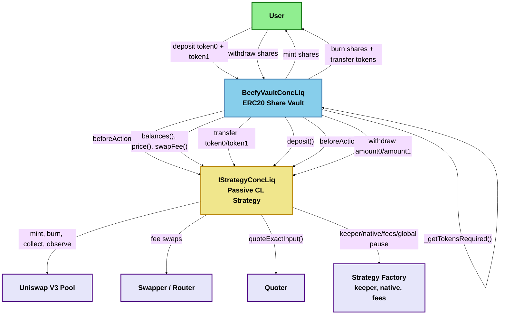
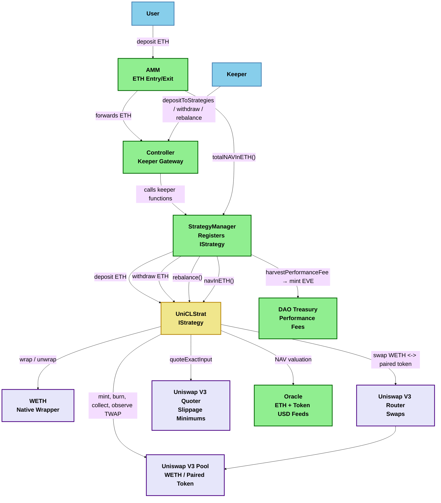
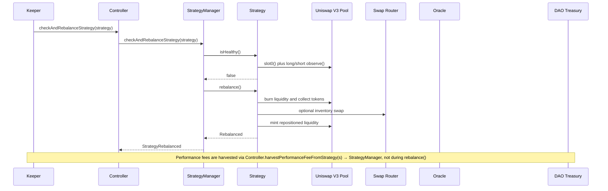

# Uniswap Concentrated Liquidity Strategy Specification

## Purpose

This document specifies a native-ETH strategy that implements `IStrategy` and deploys protocol funds into a Uniswap V3-style concentrated liquidity pool.

The intended behavior is adapted from the referenced passive concentrated liquidity manager pattern:

- Maintain a main LP range centered around the current pool tick.
- Keep that main range roughly symmetric, with `positionWidth * tickSpacing` above and below the current tick.
- Place any leftover token imbalance into a secondary single-sided range.
- Let a keeper periodically rebalance by removing liquidity, recalculating ticks, and adding liquidity again.

## Reference Behavior Summary

The referenced strategy family uses two positions:

- `positionMain`: a balanced position spanning `[floor(currentTick) - width, floor(currentTick) + width]`.
- `positionAlt`: a single-sided position for leftover inventory after filling the main position.

The keeper function follows this sequence:

1. Claim accrued pool fees.
2. Remove all liquidity from both positions.
3. Recompute tick ranges from the current tick.
4. Add liquidity back into the main position first.
5. Add any remaining token balance into the alternative position.

The reference implementation also blocks deposits/rebalances during volatile periods by checking the current tick against a TWAP tick with a configured maximum deviation.

## Reference Contract Details

The copied contracts show a two-contract Beefy design:

- `BeefyVaultConcLiq`: an ERC20 share vault that users interact with directly.
- `IStrategyConcLiq` implementation: the active concentrated liquidity manager that owns the pool inventory.

`IStrategyConcLiq` exposes the strategy surface to the vault:

- `balances()` returns total token0/token1 balances held directly and deployed in LP ranges.
- `beforeAction()` removes liquidity and claims/collects fees before vault accounting.
- `deposit()` deploys the current token0/token1 balances into the main and alternative ranges.
- `withdraw(uint256 amount0, uint256 amount1)` sends exact token0/token1 amounts back to the vault.
- `price()` returns token0 value in token1 terms with `36 + token1.decimals - token0.decimals` precision.
- `isCalm()` gates user deposits and strategy actions during volatile periods.
- `swapFee()` reports the underlying pool fee in 18 decimals.
- `harvest()` claims fees and charges the Beefy fee stack.

`BeefyVaultConcLiq` is responsible for share accounting and ratio-aware deposits:

1. `deposit(amount0, amount1, minShares)` calls `strategy.beforeAction()` first so all inventory is visible for accounting.
2. It reads `balances()`, `price()`, and `swapFee()`.
3. `_getTokensRequired()` determines the token0/token1 amounts that move the vault toward its current balance ratio.
4. It charges a synthetic sliding swap-fee adjustment for the side that fills the imbalance.
5. It transfers the required token0/token1 amounts directly to the strategy.
6. It calls `strategy.deposit()` so the strategy redeploys liquidity.
7. It mints vault shares based on token1-equivalent value: `(amount1 - fee1) + ((amount0 - fee0) * price / 1e36)`.
8. On the first deposit, it permanently mints `MINIMUM_SHARES = 1e3` to the burn address.

Withdrawals mirror this:

1. `withdraw(shares, minAmount0, minAmount1)` calls `strategy.beforeAction()`.
2. It burns the user's shares.
3. It calculates pro-rata token0/token1 amounts from total vault balances.
4. It calls `strategy.withdraw(amount0, amount1)`.
5. It transfers token0/token1 to the user and checks minimum amounts for slippage.

The strategy inherits `StratFeeManagerInitializable`, which supplies:

- `vault`, `unirouter`, `strategist`, and `factory` addresses.
- `native`, `keeper()`, fee recipient, and fee config lookups through the factory.
- paused/global-pause checks.
- locked-profit accounting over a 1 hour duration.
- `lastHarvest` and `lastPositionAdjustment` timestamps.

Supporting libraries and interfaces from the excerpts (implemented under `src/libraries/strategies/uni-cl-strategy/` and `src/interfaces/integrations/` where noted):

- `LiquidityAmounts`: calculates liquidity from token amounts and token amounts from liquidity over a tick range.
- `TickMath`: converts ticks to Q64.96 sqrt prices.
- `TickUtils`: floors ticks to spacing, derives symmetric `baseTicks()`, quotes add-liquidity amounts, and path encoding helpers.
- `UniV3Utils`: wraps exact-input router swaps over encoded Uniswap V3 paths.
- `IBeefySwapper`: abstract swapper with `swap()` and `getAmountOut()`.
- `IQuoter`: returns `quoteExactInput(path, amountIn)`.

## Adaptation To Everything Strategy

The reference Beefy design should not be copied 1:1 because this protocol already has its own entry token, NAV accounting, and strategy manager. The main adaptation is to collapse the Beefy vault-side behavior into our strategy boundary:

- There should be no separate Beefy-style ERC20 share vault. EVE already represents the user-facing claim.
- `StrategyManager` calls this strategy with native ETH, not token0/token1 transfers from end users.
- Ratio selection from `_getTokensRequired()` still matters, but it should become internal deposit logic that decides how much WETH to swap into the paired token before minting liquidity.
- `beforeAction()` is not part of this repo's `IStrategy`; its behavior should be embedded inside `deposit()`, `withdraw()`, `rebalance()`, and `navInETH()` as needed.
- Beefy share math is reference-only. Our accounting source of truth is `navInETH()`, consumed by `StrategyManager.totalNAVInETH()` and then the AMM.
- Beefy's call/strategist/beefy fee stack should not be copied directly. This protocol should instead implement a DAO performance fee, described below.

## Strategy Contract Shape

Recommended contract name: `UniCLStrat`.

Recommended deployment type: static/non-upgradeable, matching the repository's strategy guidance that strategy contracts are "code is law".

The strategy must implement `IStrategy`:

- `deposit()` receives native ETH from `StrategyManager`.
- `withdraw(address _receiver, uint256 _amount)` returns native ETH to the Controller.
- `rebalance()` maps to the reference strategy's `moveTicks()` behavior.
- `navInETH()` reports total strategy NAV in ETH, including idle ETH/WETH, non-WETH token inventory, active liquidity, and uncollected fees.
- `isHealthy()` reports whether the position is still within the acceptable rebalance band and whether the pool price is calm.

## External Dependencies

The strategy is expected to integrate with:

- WETH/native wrapper for converting incoming ETH into WETH and outgoing WETH into ETH.
- Uniswap V3 pool for `slot0()`, `observe()`, `mint()`, `burn()`, `collect()`, `positions()`, `fee()`, `token0()`, `token1()`, and `tickSpacing()`.
- Uniswap V3 swap router for converting part of the deposited WETH into the paired token and for converting withdrawals back to WETH.
- Uniswap V3 quoter, Beefy-style swapper, or off-chain keeper quotes for slippage-aware swap sizing.
- Protocol `Oracle` for NAV valuation when the paired token is not WETH.
- In-repo implementations: `src/libraries/strategies/uni-cl-strategy/` (`LiquidityAmounts`, `TickMath`, `TickUtils`, `FullMath`, `FixedPoint96`).

The pool should include WETH as either `token0` or `token1`; otherwise native ETH entry/exit becomes a multi-hop strategy and should be treated as a separate design.

## Tick Placement

Definitions:

- `tickFloor = floor(currentTick, tickSpacing)`.
- `width = positionWidth * tickSpacing`.
- `mainLower = tickFloor - width`.
- `mainUpper = tickFloor + width`.

Alternative range placement:

- If leftover token value is mostly token1, place the alternative range below current price: `[tickFloor - width, tickFloor - tickSpacing]`.
- If leftover token value is mostly token0, place the alternative range above current price: `[tickFloor + tickSpacing, tickFloor + width]`.
- If balances are equal and the alternative range would match the main range, skip the alternative position.

This mirrors the reference design: the main range receives the maximum balanced liquidity first, then the alternative range acts as a passive limit order for the side that remains.

## Lifecycle

### Deposit

`deposit()` is called by `StrategyManager` with native ETH.

1. Revert on zero ETH.
2. Wrap ETH into WETH.
3. Claim/collect current fees and remove liquidity if needed for exact accounting, mirroring the reference `beforeAction()` behavior.
4. Read current token0/token1 inventory, pool price, and pool swap fee.
5. Use the `_getTokensRequired()` idea from `BeefyVaultConcLiq` to determine the desired token ratio. In this repo, the strategy starts from WETH, so it should swap only the required WETH amount into the paired token instead of accepting both tokens from a user.
6. If ticks are not initialized, set main and alternative ticks from the current pool tick.
7. Add liquidity into the main position.
8. Add remaining token inventory into the alternative position.
9. Emit `FundsDeposited(msg.value)`.

Deposits should be blocked when `isCalm()` is false.

### Withdraw

`withdraw(_receiver, _amount)` is called by `StrategyManager` and returns native ETH.

1. Claim/collect current fees and remove liquidity from active ranges for accounting, mirroring the reference `beforeAction()` behavior.
2. Calculate the token0/token1 amounts that represent `_amount` of ETH-denominated NAV.
3. Keep or withdraw the required WETH-side amount and swap the needed paired-token proceeds back into WETH using caller/keeper-supplied slippage limits or conservative stored limits.
4. Unwrap WETH into ETH.
5. Send ETH to `_receiver`.
6. Re-add remaining liquidity if the strategy is not paused.
7. Emit `FundsWithdrawn(actualAmount)`.

`maxWithdrawal()` should return the amount of ETH that can be withdrawn immediately under the configured slippage assumptions.

### Rebalance

`rebalance()` is called by `StrategyManager` when `isHealthy()` is false.

1. Require `isCalm()` to avoid rebalancing into manipulated spot prices.
2. Claim and account for pool fees.
3. Remove all active liquidity.
4. Recompute main and alternative ticks.
5. Optionally swap inventory toward the desired main-position ratio using the same ratio logic as deposit.
6. Add liquidity back to the main position.
7. Add leftover inventory to the alternative position.
8. Emit `Rebalanced()`.

DAO performance fees are **not** collected during rebalance — harvest via StrategyManager separately.

The keeper should trigger this via `Controller.checkAndRebalanceStrategy(strategy)` or the ranged strategy rebalance functions.

### Donated Idle ETH (`investIdleETH`)

Native ETH sent directly to the strategy (via `receive()`) remains idle until an admin calls `investIdleETH()`:

- Only `ADMIN_ROLE` on Registry may call `investIdleETH()`.
- Wraps idle `address(this).balance` and deploys into the pool using the same calm-gated path as `deposit()`.
- Donations are exogenous capital — they do not affect strategy-local LP-fee performance accounting.
- Emits `FundsInvested(uint256 amount)` where `amount` is idle native ETH at call start only (collected fees re-deployed in the same call are excluded).

This is separate from the keeper flow (`Controller.depositToStrategies()` → `StrategyManager.depositToStrategies()` → `strategy.deposit()`), which deploys capital via the normal deposit path.

## Health Model

`isHealthy()` should return false when any of the following is true:

- Current tick is outside the main range.
- Current tick has moved more than `rebalanceTickThreshold` from the range center.
- Current tick or short TWAP differs from the main TWAP by more than `maxTickDeviation`.
- Pool oracle observations are unavailable or too short for the configured `twapInterval`.
- Strategy is paused or an invariant check fails.

`isCalm()` should compare:

- Spot tick from `slot0()`.
- Main TWAP tick over `twapInterval`.
- Optional short TWAP tick over a small interval, such as 3 seconds, to reduce single-block manipulation risk.

## DAO Performance Fees

Performance fees are implemented **inside each strategy** (LP-fee base for UniCLStrat) with **StrategyManager** orchestrating settlement via EVE mint to the DAO treasury (bonding-curve dilution) without unwinding LP inventory on every harvest.

### StrategyManager model (source of truth)

- **Fee base (v1)**: Uncharged LP trading fees only — tracked in native token quantities inside UniCLStrat; converted to ETH at view/settle time via Oracle.
- **Accrual**: UniCLStrat pokes positions (`burn(..., 0)`) then accrues `tokensOwed` deltas into cumulative counters on every remove/collect path (`deposit` / `withdraw` / `rebalance` / `investIdleETH` / pause unwind) — required before collect zeros owed, otherwise the pending view's live delta is lost. Accruing after a full burn would briefly include withdrawn principal in `tokensOwed` and inflate the fee base — poke-then-accrue avoids that. `sync()` is poke-only (NAV and pending update from `tokensOwed`; no counter flush). `pendingPerformanceFeeInETH(bps)` includes already-materialized fees via a live `tokensOwed - snapshot` delta; `settlePerformanceFee(bps)` accrues that same base then charges (no poke — settlement matches the pending view that SM/keepers gate on). Unpoked fee growth waits for `sync()` or remove/collect. StrategyManager delegates via `pendingPerformanceFeeInETH(strategy)`.
- **Settlement**: `Controller.harvestPerformanceFeeFromStrategy(s)` → StrategyManager calls `strategy.settlePerformanceFee(bps)` (accrue already-materialized fees, no poke); one EVE mint per batch at `evesToMint = totalFeeETH * supply / (totalNAV - totalFeeETH)`.
- **Lifecycle**:
  - Harvest marks LP fees as charged inside the strategy.
  - Withdrawals batch-harvest accrued fees before withdrawal.
  - While `paused()`, `pendingPerformanceFeeInETH` / `settlePerformanceFee` return 0 (counters preserved for post-unpause harvest).
  - `emergencyExit()` writes off pending strategy-local fees after sweeping held funds (best-effort accrue then charged = earned — prevents phantom harvest of pre-exit pending if later unpaused).
- **Configuration**: `FeeConfig{daoTreasury, performanceFeeBps}` at `initialize()`; `setDaoTreasury` / `setPerformanceFeeBps` (admin). Treasury must be non-zero; `performanceFeeBps == 0` disables harvesting.
- **Access**: `ADMIN_ROLE` or `KEEPER_ROLE` on Registry for harvest; StrategyManager holds `MINTER_ROLE` on Registry.
- **Deploy env**: `DAO_TREASURY_ADDRESS`, `PERFORMANCE_FEE_BPS` (required; `0` disables fees).

UniCLStrat responsibilities: poke-only on `sync()` (materialize `tokensOwed` for NAV/pending); poke-then-accrue on remove/collect; settle/pending over materialized fees only; report accurate `navInETH()`; freeze pending/settle while paused; on `emergencyExit()` best-effort `_tryAccrueLpFees` (aggregate snapshot fallback if `positions` reverts) then charged = earned.

### Legacy USD-HWM design (not adopted)

The following described StrategyManager USD high-water marks and was **replaced** by strategy-local LP-fee accounting:

- USD HWM per strategy seeded on `addStrategy()`, bumped on deposits, reset on harvest/withdraw/emergency exit.
- `pending = (navInUSD - hwm) * performanceFeeBps / 10_000`.

### Legacy in-strategy NAV-HWM design (not adopted)

The following described an ETH fee model inside the strategy contract and was **not implemented**:

- Local `daoTreasury`, `performanceFeeBps`, `highWatermarkNAVInETH` state on UniCLStrat.
- Paying fees by converting inventory to ETH and transferring to treasury during `rebalance()` / `harvestPerformanceFee()`.
- Pro-rata HWM adjustments inside the strategy on deposit/withdraw.

See `StrategyManager.sol` and `IStrategyManager.sol` for the live fee interface.

## NAV Calculation

`navInETH()` must include:

- Idle native ETH.
- Idle WETH.
- Idle paired token value converted to ETH.
- Active liquidity amounts in the main position.
- Active liquidity amounts in the alternative position.
- Uncollected fees owed by the pool (`tokensOwed0/1` in Uniswap V3 position storage are lazily updated until `collect`, `burn`, or `mint` touches the position).

Uniswap V3 liquidity is removable synchronously via `withdraw()`; there is no separate queue-withdrawal path.

**Keeper sync:** `IStrategy.sync()` (Controller `KEEPER_ROLE` → StrategyManager → strategy) refreshes implementation-defined on-chain state. UniCLStrat pokes each deployed position with `pool.burn(tickLower, tickUpper, 0)` so accrued LP fees flow into `tokensOwed` storage (readable by `navInETH()` and by `pendingPerformanceFeeInETH` via the live `tokensOwed - snapshot` delta) — without removing liquidity, calling `collect()`, or flushing durable LP-fee counters. Keepers may call it periodically; sync is not required to change `navInETH()`. Durable counter flush (`_accrueLpFees`) happens on `settlePerformanceFee` and on `_removeLiquidityAndCollect()` (deposit / withdraw / rebalance / investIdleETH / pause unwind), where poke-then-accrue is required so fee growth is never collected into inventory without entering the fee counters.

In the Beefy reference, `balances()` returns token0/token1 inventory after subtracting unharvested fees and locked profit. In this protocol, LP trading fees remain strategy assets in `navInETH()`; DAO performance fees are settled separately by StrategyManager via EVE minting.

Valuation should avoid spot-only pricing. Preferred approach:

1. Use Uniswap liquidity math and current pool state to calculate token amounts recoverable from active positions.
2. Convert WETH 1:1 to ETH.
3. Convert paired-token balances to ETH through the protocol `Oracle` by converting token/USD and ETH/USD, or through a sufficiently long pool TWAP if no Chainlink-style feed exists.

Because `navInETH()` feeds AMM pricing (via `StrategyManager.totalNAVInETH()`), stale or manipulable valuation should cause the strategy to report unhealthy and block deposits/rebalances rather than returning optimistic NAV. If `navInETH()` reverts, `StrategyManager.totalNAVInETH()` reverts and the hot path halts until the strategy is fixed or force-removed via `forceRemoveStrategy()`.

## Configuration

Constructor takes a single `IUniCLStrat.DeploymentConfig` struct:

- **`AddressConfig`**: `registry`, `weth`, `pool` (Oracle / Converter resolved via Registry)
- **`RouteConfig`**: `swapAdapter`, `wethToPairedTokenPath`, `pairedTokenToWethPath`
- **`StrategyConfig`**: `positionWidth`, `rebalanceTickThreshold`, `maxTickDeviation`, `twapInterval`, `shortTwapInterval`, `maxTotalNAV`

Deploy via `script/DeployUniCLStrat.s.sol` with `REGISTRY_ADDRESS` and env-driven strategy parameters (bytecode only — no `addStrategy`; requires prior timelocked `Converter.setAllowedAdapter`). Register the strategy via the 48h admin timelock (`StrategyManager.addStrategy`; paired-token Oracle feed / optional `addSupportedERC20` usually share the allowlist batch). Performance-fee treasury and rate are configured on StrategyManager at protocol deploy (`DAO_TREASURY_ADDRESS`, `PERFORMANCE_FEE_BPS`), not in UniCLStrat.

Mutable parameters (`ADMIN_ROLE` on Registry):

- `setPositionWidth(int24)`
- `setMaxTickDeviation(int56)`
- `setRebalanceTickThreshold(int24)`
- `setTwapInterval(uint32)` / `setShortTwapInterval(uint32)`
- `setRouteConfig(adapter, wethToPairedPath, pairedToWethPath)`
- `setSwapSlippageBps(uint256)`
- `setMaxTotalNAV(uint256)`
- `pause()` / `unpause()`

Allocation weights (`depositWeight` / `withdrawalWeight`) are set on StrategyManager
(`addStrategy` / `setDepositWeight` / `setWithdrawalWeight` / `setStrategyWeights`), not on UniCLStrat.

Performance-fee treasury and rate: `StrategyManager.setDaoTreasury` / `setPerformanceFeeBps` (`ADMIN_ROLE` on Registry).

All setters should emit events and validate bounds.

## Access Control

Registry-centric constraints (implemented via `RegistryClient`):

- Only the registered `STRATEGY_MANAGER` contract on Registry can call `deposit()`, `withdraw()`, and `rebalance()`.
- Only `ADMIN_ROLE` on Registry can call `investIdleETH()` (deploy donated idle native ETH).
- Configuration setters and pause require `ADMIN_ROLE` on Registry.
- Keeper path remains Controller (`KEEPER_ROLE` on Registry) → StrategyManager (registered `CONTROLLER`) → UniCLStrat (`deposit` / `withdraw` / `rebalance` / `sync`).
- **`sync()`:** `STRATEGY_MANAGER` caller only. UniCLStrat pokes deployed positions with `pool.burn(..., 0)` so accrued LP fees materialize in `tokensOwed` without removing liquidity, calling `collect()`, or flushing durable fee counters; semantics are otherwise implementation-defined.
- **`emergencyExit()`:** `ADMIN_ROLE` or `SECURITY_ROLE` on Registry (not StrategyManager). Requires pause. Unwrap WETH and send native ETH to StrategyManager; emit `EmergencyExited(ethAmount)`. Transfer `pairedToken` to StrategyManager as ERC-20 — whitelist via `addSupportedERC20()` so NAV counts recoverable value. On-chain swap recovery of stranded supported ERC-20s back to native ETH via the shared Converter is deferred to a follow-up PR.
- DAO performance-fee recipient and rate: StrategyManager admin setters (timelocked in production).

## Risk Controls

Implementation must include:

- Reentrancy protection around deposit, withdraw, and rebalance.
- Strict Uniswap mint callback validation: caller must be the configured pool and the strategy must be in a minting state.
- Slippage controls for swaps and liquidity removal.
- TWAP/calm-period checks before deposits and rebalances.
- Tick validation against min/max tick and tick spacing.
- Approval lifecycle management with revoke-on-pause/panic.
- Conservative `maxDeposit()` and `maxWithdrawal()` values.
- Explicit decision that Beefy share issuance, `MINIMUM_SHARES`, and locked-profit streaming are not part of this strategy unless added as protocol-level features.
- DAO performance-fee accounting: strategy-local LP fees with StrategyManager dilution settlement — see `test/unit/StrategyManager.t.sol` and `test/unit/UniCLStrat.t.sol` (LP-fee accrual, harvest, emergency-exit write-off, paginated harvest).
- Tests for manipulated spot price, stale oracle data, invalid ticks, callback spoofing, and withdrawal slippage.

## Reference Beefy Flow Diagram

## Architecture Diagram

## Rebalance Flow Diagram

## Implementation Checklist

- Add minimal Uniswap V3 interfaces and libraries needed for pool math, tick math, callback, router, and WETH.
- Implement `UniCLStrat` against the current `IStrategy` interface.
- Add unit tests with mocked pool/router/oracle for deposit, withdraw, NAV, health, and rebalance branches.
- Add mainnet fork tests for a real WETH pair (`test/fork/UniCLStratFork.t.sol`).
- Validate the exact MonadVision contracts once source access is available, especially constructor parameters, rebalance thresholds, fee handling, and callback behavior.
